## Índice

0. [Ficha del proyecto](#0-ficha-del-proyecto)
1. [Descripción general del producto](#1-descripción-general-del-producto)
2. [Arquitectura del sistema](#2-arquitectura-del-sistema)
3. [Modelo de datos](#3-modelo-de-datos)
4. [Especificación de la API](#4-especificación-de-la-api)
5. [Historias de usuario](#5-historias-de-usuario)
6. [Tickets de trabajo](#6-tickets-de-trabajo)
7. [Pull requests](#7-pull-requests)

---

## 0. Ficha del proyecto

### **0.1. Tu nombre completo:**

David Navarro Arias

### **0.2. Nombre del proyecto:**

Cactify

### **0.3. Descripción breve del proyecto:**

Plataforma web para la gestión de colecciones de cactus y pequeños viveros. Permite registrar plantas asociadas a una especie, introducir manualmente condiciones ambientales (humedad, temperatura, horas de luz, acidez del sustrato) y riego, y recibir recomendaciones de cuidado generadas por IA a partir de los rangos recomendados de cada especie y el historial de la planta. Nace del problema real de gestionar una colección de ~500 cactus, donde el conocimiento y el seguimiento manual (memoria, hojas de cálculo) dejan de ser viables a partir de cierto tamaño.

### **0.4. URL del proyecto:**

La aplicación no tiene todavía un despliegue público. Una vez levantado el entorno local completo,
se accede al frontend en [http://localhost:3005](http://localhost:3005) y al API en
[http://localhost:8080](http://localhost:8080).

### 0.5. URL o archivo comprimido del repositorio

[Repositorio de Cactify en GitHub](https://github.com/dnavarro-bj/AI4Devs-finalproject)

La rama de esta entrega es `feature-entrega2-DNA`.

El registro del uso de IA está en [prompts.md](prompts.md) —un prompt clave por área, con la nota de
cómo se guio al asistente y qué se corrigió a mano— y las conversaciones completas, día a día, en
[chats/](chats/).

---

## 1. Descripción general del producto

### **1.1. Objetivo:**

Ayudar a coleccionistas y pequeños viveros a registrar sus plantas, introducir condiciones de cultivo (de momento de forma manual) y recibir recomendaciones de cuidado personalizadas basadas en la especie y en los datos registrados, para no depender de la memoria o la intuición del propietario a medida que la colección crece.

**Problema:** los coleccionistas y pequeños viveros gestionan cientos de plantas de forma manual, lo que dificulta saber qué plantas necesitan riego, detectar condiciones de estrés, mantener un historial de cuidados y tomar decisiones basadas en datos.

**Usuario principal:** propietario de una colección de cactus o de un pequeño vivero (uso individual en el MVP, con el modelo pensado para poder extenderse a varios usuarios/organizaciones en el futuro).

**Solución:** una plataforma web que registra plantas, permite introducir manualmente lecturas ambientales y de riego, y utiliza IA para generar recomendaciones de cuidado y niveles de riesgo, apoyándose en una base de conocimiento por especie (rangos de humedad, temperatura, luz y riego).

### **1.2. Características y funcionalidades principales:**

Flujo principal (E2E) del MVP:

```text
Registrar especie y sus rangos de cuidado recomendados
        ↓
Registrar un cactus seleccionando su especie y ubicación
        ↓
Introducir manualmente lecturas (humedad, temperatura, horas de luz, acidez del sustrato, riego)
        ↓
El sistema compara las lecturas con los rangos recomendados de la especie
        ↓
La IA genera una recomendación personalizada (nivel de riesgo, explicación, acción, prioridad)
        ↓
La recomendación queda guardada en el historial de la planta
```

Funcionalidades construidas y utilizables en esta entrega:

* **Catálogo de especies**: cada especie tiene una ficha con sus rangos de cuidado recomendados (humedad, temperatura, horas de luz, frecuencia orientativa de riego) y una mezcla de tierra (soil mix) recomendada. Esta base de conocimiento es determinista, no generada por IA.
* **Catálogo de mezclas de tierra (soil mix)**: mezclas reutilizables definidas por su proporción de componente orgánico y mineral (deben sumar 100%), para poder asociarlas a una o varias especies.
* **Catálogo de localizaciones**: listado plano y reutilizable de ubicaciones (p. ej. "Invernadero 1", "Bandeja A3"), para asociarlas a las plantas sin depender de texto libre. No es jerárquico en el MVP (ver evolución futura en [F.1](docs/user-stories/F.1-organizar-cactus-por-ubicacion-jerarquica.md)).
* **Catálogo de tags**: etiquetas reutilizables (p. ej. "globular", "pequeño", "sin espinas", "híbrido") asignables a varias plantas, para poder filtrar y buscar la colección de forma sencilla.
* **Inventario de plantas**: alta de cactus asociados a una especie y a una localización, con herencia de los cuidados recomendados de su especie.
* **Registro de lecturas/cuidados**: introducción manual de humedad, temperatura, horas de luz, acidez del sustrato y cantidad de riego, asociadas a una planta y con fecha/hora automática.
* **Recomendaciones con IA**: la IA recibe la especie, la última lectura, el último riego y las desviaciones respecto a los rangos recomendados, y genera un nivel de riesgo, una explicación breve, una acción recomendada y una prioridad de actuación. La IA no decide de forma autónoma ni se "inventa" los rangos de cuidado: estos provienen de la ficha de la especie y la IA solo interpreta esos datos.
* **Historial**: consulta de lecturas, riegos y recomendaciones de IA ordenadas por fecha, accesible desde la ficha de cada planta.
* **Administración de catálogos**: alta, consulta, edición y retirada de especies, mezclas y localizaciones; las etiquetas se pueden renombrar, retirar o combinar sin perder asignaciones.
* **Aplicación de administración**: navegación lateral, breadcrumbs, búsqueda global con datos de ejemplo, estados de carga/error/vacío y pantallas de inventario y catálogos fieles al wireframe.
* **Sistema de diseño propio**: 53 componentes públicos reutilizables, documentados en la galería viva `/ui-kit`, incluidos tabla, filtros, paginación, árbol, cronología, agenda, calendario, diálogo y patrones multimedia (`UiTreeNode` es una pieza interna del árbol y no se cuenta aparte).

La visión completa del producto —incluidos personalización por ejemplar, fotografías, tareas,
alertas con ciclo de vida, localizaciones jerárquicas e inventario a escala— está documentada en
[la definición funcional y de UX](docs/producto/definicion-funcional-y-ux.md). Esos módulos forman
parte del producto objetivo, pero no se presentan como implementados en esta entrega.

**Explícitamente fuera del alcance del MVP** (quedan documentadas como evolución futura del producto, no como parte de esta entrega):

* Automatización física de riego (bombas, válvulas).
* Integración en tiempo real con sensores/hardware IoT (p. ej. ESP32) — la carga de lecturas será manual en el MVP.
* App móvil con sincronización de sensores por Bluetooth (ver [F.5](docs/user-stories/F.5-app-movil-sincronizacion-sensores-bluetooth.md)) — máxima prioridad del roadmap tras el MVP.
* Alertas push en tiempo real.
* Detección de enfermedades o estimación de estrés hídrico por fotografía.
* Predicción de riego mediante series temporales / modelos entrenados con datos propios.
* Gestión comercial del vivero (stock, ventas, pedidos, facturación).
* Multiempresa y suscripciones tipo SaaS.

### **1.3. Diseño y experiencia de usuario:**

La interfaz está pensada para administrar entre 500 y 2000 ejemplares: navegación estable por
módulos, listados paginados, filtros combinables y fichas que priorizan identidad, estado y acciones.
No depende de una librería visual externa; usa un sistema de diseño propio gobernado por tokens y
documentado en [docs/ui-kit](docs/ui-kit/README.md). Los [wireframes navegables](docs/wireframes/README.md)
son la referencia de arquitectura de información, jerarquía y flujos.

Recorrido recomendado para evaluar la entrega local:

1. Abrir `/plants` para consultar y filtrar el inventario.
2. Entrar en una planta para revisar cuidados heredados, historial de lecturas y, si hay
   `OPENAI_API_KEY` configurada, generar el análisis de IA de una lectura.
3. Usar `/species`, `/soil-mixes`, `/locations` y `/tags` para comprobar los catálogos y sus fichas.
4. Abrir `/ui-kit` para revisar los componentes y estados reutilizables.

#### Capturas del sistema funcionando

Capturas tomadas del entorno local (`docker compose up --build`) el 9 de septiembre de 2026, contra
el API real y la base de datos con las migraciones y las semillas aplicadas. Los bloques marcados
como *maqueta* o con un ticket (`T-15`, `T-20`, `T-23`…) son composición del wireframe que su ticket
todavía no alimenta: se muestran señalados a propósito, nunca rellenos con datos inventados.

**Inventario** — listado paginado con filtros por localización y etiqueta, columnas configurables y
las columnas pendientes marcadas con su ticket:

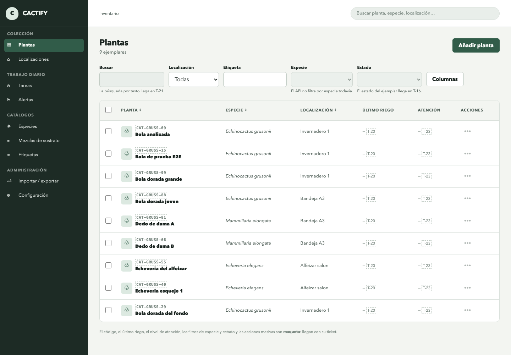

**Ficha del ejemplar** — el corazón del flujo E2E: cuidados heredados de la especie, cronología del
historial con las lecturas reales registradas y la acción para pedir el análisis de IA de cada una:

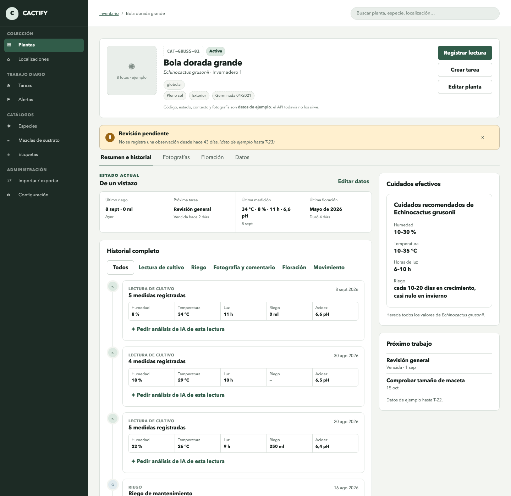

**Alta de planta** — selección de especie desde el catálogo, con los cuidados que la planta heredará
a la vista antes de guardar:

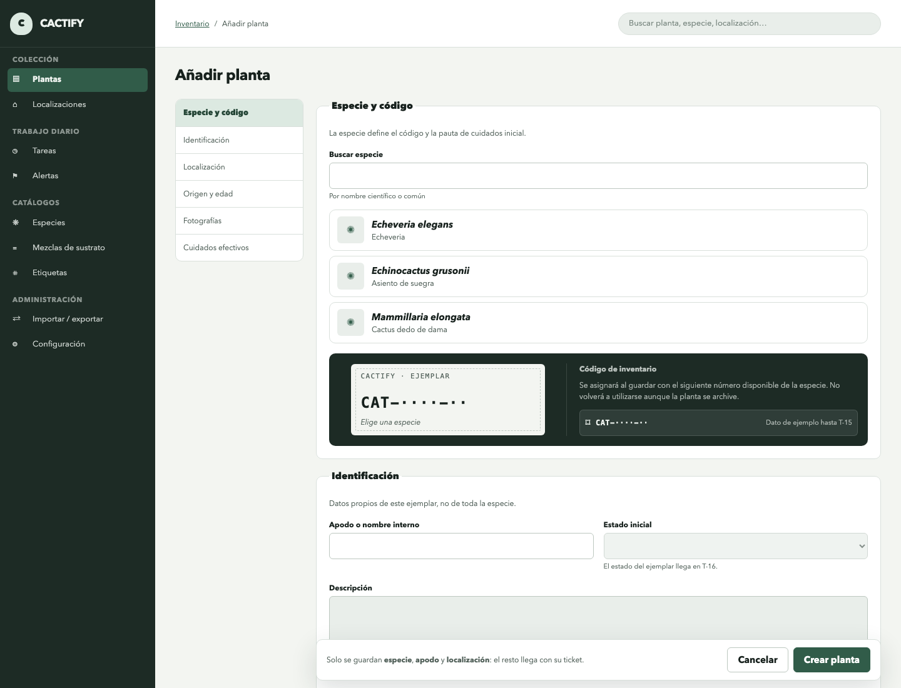

**Catálogo de especies y ficha de especie** — la base de conocimiento determinista sobre la que la IA
razona después:

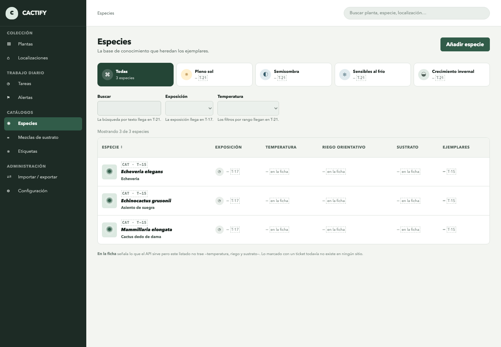

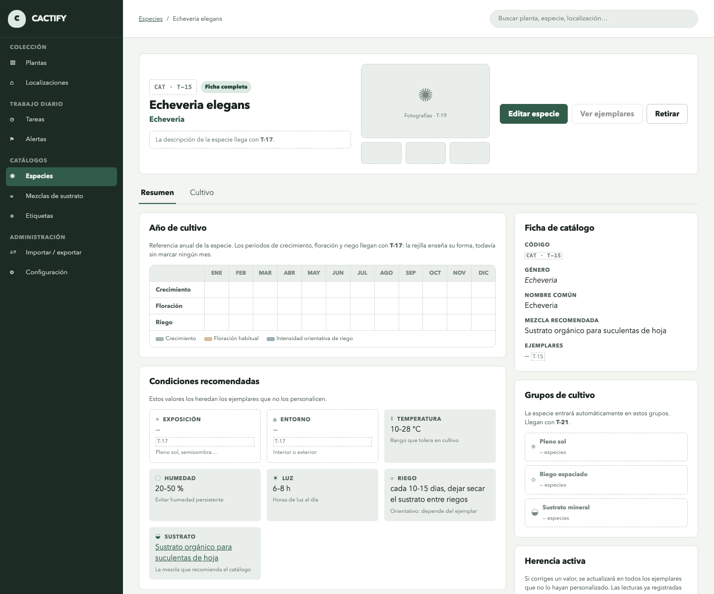

**Catálogos de apoyo** — mezclas de sustrato con su proporción orgánico/mineral, mapa de
localizaciones con el recuento de ejemplares por sitio, y etiquetas con su uso en la colección:

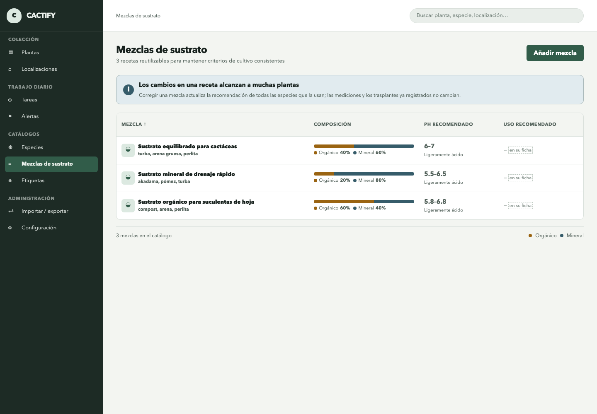

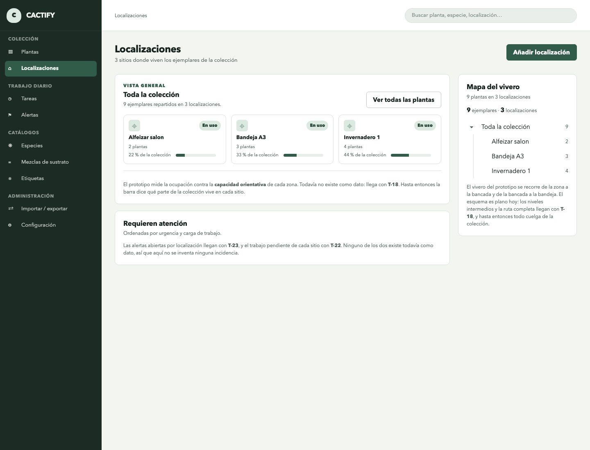

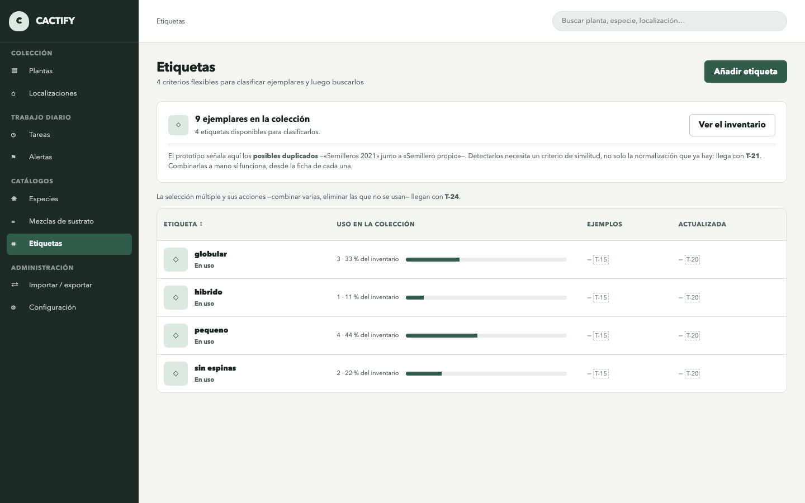

**Sistema de diseño** — la galería viva en `/ui-kit` monta los componentes reales de la aplicación:

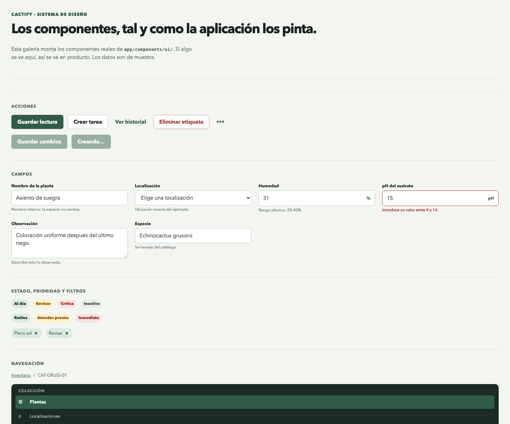

> **Análisis de IA:** la generación de recomendaciones exige `OPENAI_API_KEY` en el entorno. El
> entorno con el que se tomaron estas capturas corre sin clave, así que no se incluye captura del
> resultado del análisis: el sistema responde entonces `502` con el cuerpo de error uniforme, que es
> el comportamiento probado en la suite. El flujo completo —generación, persistencia, idempotencia y
> traducción del fallo del proveedor— está cubierto por tests de integración con el proveedor
> sustituido por un doble.

### **1.4. Instrucciones de instalación:**

Requisitos: Docker y Docker Compose. Todo lo demás (JDK, Node, PostgreSQL) va dentro de los contenedores.

```bash
cd iac/local
cp .env.example .env   # ajusta las variables si hace falta
docker compose up --build
```

Levanta PostgreSQL (puerto de host `25432`), el backend en `:8080` y el frontend en `:3005`.
Incluye inventario, alta y ficha de planta, registro e historial de lecturas, análisis de IA y los
catálogos de especies, sustratos, localizaciones y etiquetas. Al arrancar, el backend aplica las
migraciones de Flyway y carga los datos semilla, así que la API queda usable sin ningún paso manual.
La clave `OPENAI_API_KEY` es opcional para navegar y usar el resto del sistema; sin ella solo falla la
generación de recomendaciones. Detalle y variables en [iac/local/README.md](iac/local/README.md).

Para ejecutar la suite de tests del backend hace falta Docker en marcha (los tests de integración levantan un PostgreSQL real con Testcontainers):

```bash
cd backend
./gradlew test
```

Los tests del frontend se ejecutan aparte:

```bash
cd frontend
yarn install --frozen-lockfile
yarn test
```

---

## 2. Arquitectura del Sistema

### **2.1. Diagrama de arquitectura:**

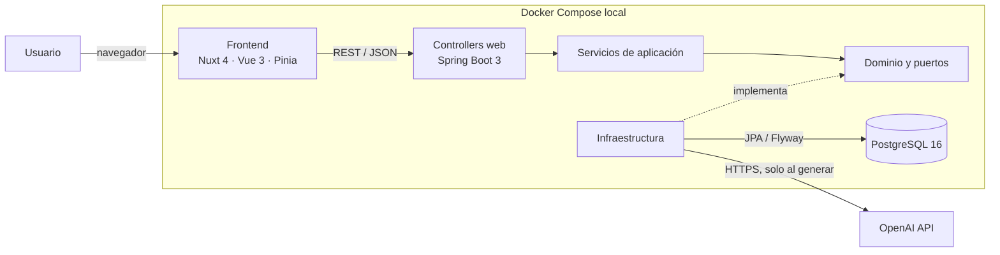

El backend aplica una arquitectura por capas con dependencias hacia dentro: `web → application →
domain`; `infrastructure` implementa los puertos del dominio. Esto mantiene las reglas de negocio y
los casos de uso separados de HTTP, JPA y el proveedor de IA, a cambio de más tipos y mapeos que en
un CRUD directo. El frontend replica esa disciplina por feature: `Component → Composable → Service
→ HTTP`; Pinia solo se usa cuando el estado debe compartirse entre features. Las decisiones y sus
trade-offs quedan registradas en [los ADR](docs/adr/README.md).

### **2.2. Descripción de componentes principales:**

* **Frontend**: Nuxt 4, Vue 3 y Pinia. Está organizado por features y consume el API desde el cliente. La presentación usa CSS propio gobernado por tokens y 53 componentes públicos `Ui*`; no usa Tailwind ni otra librería de estilos.
* **Backend**: Kotlin 2.3 sobre Java 21 y Spring Boot 3.5, con Spring Web, Bean Validation, Spring Data JPA y Flyway.
* **Base de datos**: PostgreSQL 16. Los tests de integración usan también PostgreSQL real mediante Testcontainers, no una base en memoria.
* **IA**: adaptador dedicado para OpenAI. El dominio entrega contexto estructurado y el proveedor devuelve una recomendación; la respuesta se valida y persiste, y una recomendación ya creada no vuelve a generar coste.
* **Infraestructura local**: Docker Compose construye y conecta base de datos, backend y frontend con comprobación de salud de PostgreSQL.

### **2.3. Descripción de alto nivel del proyecto y estructura de ficheros**

Monorepo con el backend, el frontend, la infraestructura local y la documentación viva del proyecto:

```text
backend/     Kotlin + Spring Boot 3 (API REST, JPA, Flyway)
frontend/    Nuxt 4 + Vue 3 + Pinia
iac/local/   Docker Compose para levantar el entorno completo
docs/        ADRs, tickets, historias de usuario y diagramas
openspec/    Specs de lo construido y changes en curso (spec-driven development)
```

El backend sigue la disciplina de capas de [ADR-006](docs/adr/ADR-006-aislamiento-del-dominio.md) — `web` → `application` → `domain`, con `infrastructure` implementando los puertos:

```text
com.cactify
├── domain           Entidades JPA e identificadores tipados, más:
│   ├── repos          Puertos de repositorio (interfaces propias, sin Spring)
│   └── specs          Specifications de consulta (filtros del inventario)
├── application      Servicios de caso de uso, y:
│   └── dto            DTOs de respuesta y el envelope PageResponse
├── infrastructure
│   └── persistence    Interfaces Spring Data que implementan los puertos, y converters/
└── web
    ├── controllers    Controllers REST y sus cuerpos de petición
    └── errors         Manejador global de errores y el cuerpo ErrorResponse
```

Las dos reglas que sostienen la estructura: los controllers solo conocen `application` (nunca repositorios ni entidades), y los servicios devuelven DTOs ya montados dentro de la transacción, con `spring.jpa.open-in-view` apagado.

### **2.4. Infraestructura y despliegue**

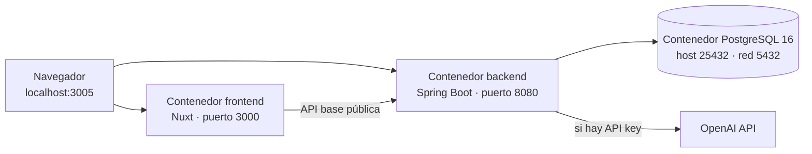

El despliegue disponible en esta entrega es local y reproducible mediante
[`iac/local/docker-compose.yml`](iac/local/docker-compose.yml). `docker compose up --build` construye
imágenes multi-stage para frontend y backend, espera al *healthcheck* de PostgreSQL y después arranca
los servicios. Flyway versiona el esquema y carga las semillas durante el arranque del backend. Los
datos sobreviven en el volumen `cactify_pgdata`; secretos y credenciales entran por variables de
entorno documentadas en `.env.example`. No se afirma un despliegue cloud que todavía no existe.

### **2.5. Seguridad**

Implementado:

* **Validación de entradas en dos niveles**: sintáctica en los cuerpos de petición con Bean Validation (campos obligatorios, no en blanco), y semántica en la capa de aplicación (que la especie, la localización y los tags referenciados existan). La base de datos sigue siendo la última red con sus `FK`, `CHECK` y `UNIQUE` ([ADR-002](docs/adr/ADR-002-restricciones-en-base-de-datos.md)).
* **Errores controlados**: un manejador global traduce todo fallo de validación o referencia inexistente a `400`/`404`/`409` con un cuerpo uniforme; nada de esto se propaga como `500` ni filtra trazas.
* **Secretos por variable de entorno**: la clave de la API de IA y las credenciales de base de datos no viven en el repositorio (`iac/local/.env.example` documenta las variables, `.env` está ignorado).

Límite conocido: todavía no hay autenticación ni autorización. La entrega funciona como aplicación
monousuario en una red de confianza; no debe exponerse directamente a Internet hasta incorporar
control de acceso, HTTPS y una política de secretos para producción.

### **2.6. Tests**

Desarrollo dirigido por tests ([ADR-005](docs/adr/ADR-005-tdd.md)): los escenarios WHEN/THEN de cada spec se escriben como test antes que el código. Los tests de integración corren contra **PostgreSQL real con Testcontainers**, nunca H2 ([ADR-004](docs/adr/ADR-004-testcontainers-para-tests-de-integracion.md)).

Validación ejecutada el 9 de septiembre de 2026:

* **Backend:** `./gradlew test --rerun-tasks --console=plain` — **307 tests en verde** sobre PostgreSQL real con Testcontainers.
* **Frontend:** `yarn test` — **531 tests en verde repartidos en 71 ficheros**.
* **Build e infraestructura:** `docker compose up -d --build` — imágenes de backend y frontend construidas y los tres servicios arrancados correctamente.

La suite cubre, entre otros, estos grupos:

* **Esquema y datos**: que las migraciones apliquen sobre base limpia y sean idempotentes, que las restricciones de dominio rechacen lo que deben y que las semillas no se dupliquen al reiniciar.
* **Mapeo**: que cada entidad viaje de ida y vuelta por su identificador tipado, y que la asociación `Plant` ↔ `Tag` asigne, reemplace y vacíe correctamente.
* **API**: el ciclo HTTP completo con MockMvc —serialización, validación, manejador de errores y SQL— para el alta y el detalle de plantas, la asignación de tags, los filtros combinables del inventario, los catálogos y la paginación.
* **Consultas**: cada `Specification` por separado, que la consulta de recuento de la paginación no se rompa con el `fetch`, y que el listado no dispare un N+1 al mapear el DTO.
* **Recomendaciones de IA**: generación con el proveedor sustituido por un doble —la suite no toca la red—, idempotencia del alta, la carrera de dos peticiones simultáneas resuelta con hilos de verdad, y que un fallo del proveedor sale como `502` y no como un `400` que culpe al cliente.
* **Invariantes de dominio**: que cada entidad rechace crearse o modificarse en un estado inválido. Son los únicos tests del backend que **no arrancan un contenedor**: una regla del modelo no necesita base de datos para probarse, porque el rechazo ocurre antes de intentar persistir.
* **Lecturas de cultivo**: alta con y sin fecha del cliente, rechazo de fechas futuras y de valores fuera de rango, orden descendente con desempate estable, y que pintar el historial no dispare una consulta por lectura ni genere ninguna recomendación.
* **Fechas y auditoría**: que un instante sobreviva a la ida y vuelta con la precisión que guarda la columna, que la salida del API no dependa de la zona horaria de la máquina, y que las marcas de creación y modificación se sellen con el reloj inyectado —congelable en los tests— y avancen solo cuando deben.
* **Frontend**: arquitectura entre componentes, composables y servicios; cliente HTTP y normalización de errores; navegación; inventario y fichas; alta/edición/retirada de catálogos; y comportamiento y accesibilidad del UI kit.
* **Sistema de diseño**: ninguna pantalla introduce colores, radios, tipografías o duraciones fuera de los tokens; todos los componentes usados tienen sus variables declaradas y un único elemento raíz.

Límite conocido: el test E2E del flujo completo (crear planta → registrar lectura → generar recomendación de IA) llega con T-07. Las tres piezas existen y se prueban por separado; todavía falta recorrerlas de punta a punta contra el sistema desplegado.

---

## 3. Modelo de Datos

### **3.1. Diagrama del modelo de datos:**

> Ver diagrama Mermaid en [docs/diagramas/modelo-datos-actual.md](docs/diagramas/modelo-datos-actual.md), y la evolución prevista en los borradores de [docs/diagramas/](docs/diagramas/README.md). Entidades construidas en esta entrega:

```text
SoilMix (1) ────< (N) Species (1) ────< (N) Plant (1) ────< (N) CareRecord (1) ──── (0..1) AIRecommendation
                                    Location (1) ────< (N) ┘
                                       Plant (N) ──── (N) Tag   (tabla de unión plant_tag)
```

### **3.2. Descripción de entidades principales:**

> Cada entidad es dueña de su consistencia interna: sus reglas se comprueban al construirla y al modificarla, y una entidad no puede existir en un estado que las viole ([ADR-011](docs/adr/ADR-011-invariantes-de-negocio-en-el-dominio.md)). Las invariantes de cada una se anotan abajo junto a sus campos.
>
> Todos los `id` son TSID ([ADR-003](docs/adr/ADR-003-tsid-como-clave-primaria.md)), almacenados como `bigint`. En el código cada entidad tiene su **tipo de identificador propio** (`PlantId`, `SpeciesId`, `LocationId`…) para que el compilador impida cruzarlos, y en el API viajan como **cadena decimal** para no perder precisión en el cliente JavaScript ([ADR-008](docs/adr/ADR-008-identificadores-tipados.md)).
>
> Todas las entidades llevan además `createdAt` y `updatedAt` —instantes en `timestamptz`, sellados por la aplicación y respaldados por un `DEFAULT` en la base de datos— que se omiten en las listas de abajo por no repetirlos ocho veces ([ADR-010](docs/adr/ADR-010-fechas-y-auditoria.md)). Toda fecha del sistema es un instante y se expone en el API en tiempo universal.

**SoilMix** (catálogo de mezclas de tierra reutilizables)

* `id`: TSID. Clave primaria (entero de 64 bits ordenado por tiempo, generado en aplicación — ver [ADR-003](docs/adr/ADR-003-tsid-como-clave-primaria.md)).
* `name`: String. Nombre identificativo de la mezcla (p. ej. "Sustrato mineral de drenaje rápido").
* `organicPercentage`: Int. Porcentaje de componente orgánico (0-100).
* `mineralPercentage`: Int. Porcentaje de componente mineral (0-100). **Invariantes**: cada porcentaje entre 0 y 100, y su suma exactamente 100.
* `phMin` / `phMax`: Decimal. Rango de pH (acidez) recomendado para esta mezcla (p. ej. 5.5-6.5). **Invariantes**: ambos entre 0 y 14, y `phMin <= phMax`.
* `description`: String. Notas u componentes orientativos (p. ej. "akadama, pómez, turba").

**Species** (ficha de especie — base de conocimiento determinista de cuidados recomendados)

* `id`: TSID. Clave primaria (entero de 64 bits ordenado por tiempo, generado en aplicación — ver [ADR-003](docs/adr/ADR-003-tsid-como-clave-primaria.md)).
* `scientificName`: String. Nombre científico (género + epíteto).
* `commonName`: String. Nombre común.
* `minHumidity` / `maxHumidity`: Int. Rango de humedad recomendado (%).
* `minTemperature` / `maxTemperature`: Int. Rango de temperatura recomendado (°C).
* `minLightHours` / `maxLightHours`: Int. Horas de luz recomendadas al día.
* **Invariantes**: en los tres rangos, el mínimo no puede superar al máximo; los nombres y la pauta de riego no pueden quedar en blanco.
* `wateringGuideline`: String. Frecuencia orientativa de riego (p. ej. "cada 10-20 días").
* `soilMixId`: TSID. Clave foránea → `SoilMix.id`. Mezcla de tierra recomendada para la especie.

**Location** (catálogo de localizaciones)

* `id`: TSID. Clave primaria (entero de 64 bits ordenado por tiempo, generado en aplicación — ver [ADR-003](docs/adr/ADR-003-tsid-como-clave-primaria.md)).
* `name`: String. Nombre identificativo de la localización (p. ej. "Invernadero 1", "Bandeja A3"). Catálogo plano, sin jerarquía en el MVP.

**Plant** (ejemplar de la colección)

* `id`: TSID. Clave primaria (entero de 64 bits ordenado por tiempo, generado en aplicación — ver [ADR-003](docs/adr/ADR-003-tsid-como-clave-primaria.md)).
* `nickname`: String. Nombre o código identificativo del ejemplar. **Invariante**: no puede quedar en blanco.
* `locationId`: TSID. Clave foránea → `Location.id`.
* `speciesId`: TSID. Clave foránea → `Species.id`.
* La personalización de cuidados por ejemplar todavía no forma parte del esquema actual; está diseñada para T-16 en el [borrador de evolución del modelo](docs/diagramas/borrador-modelo-datos-gestion.md), pero no se presenta como implementada.

**Tag** (catálogo de etiquetas de búsqueda)

* `id`: TSID. Clave primaria (entero de 64 bits ordenado por tiempo, generado en aplicación — ver [ADR-003](docs/adr/ADR-003-tsid-como-clave-primaria.md)).
* `name`: String. Nombre de la etiqueta (p. ej. "globular", "pequeño", "sin espinas", "híbrido"). Único.

**plant_tag** (tabla de unión de la relación N:M entre `Plant` y `Tag`)

* `plantId`: TSID. Clave foránea → `Plant.id`.
* `tagId`: TSID. Clave foránea → `Tag.id`.
* Clave primaria compuesta (`plantId`, `tagId`).
* `createdAt` / `updatedAt`: marcas de auditoría gestionadas mediante los valores por defecto de la base de datos, porque la tabla de unión no tiene ciclo de vida JPA propio.
* No tiene entidad propia en el código: las marcas de auditoría son metadatos de infraestructura y la relación no tiene comportamiento de dominio. Se mapea como la asociación `@ManyToMany` de `Plant`, y el reemplazo del conjunto de tags es una operación de dominio (`plant.updateTags(...)`) en lugar de un borrado e inserción de filas orquestado desde el servicio.

**CareRecord** (lectura/cuidado registrado manualmente)

* `id`: TSID. Clave primaria (entero de 64 bits ordenado por tiempo, generado en aplicación — ver [ADR-003](docs/adr/ADR-003-tsid-como-clave-primaria.md)).
* `plantId`: TSID. Clave foránea → `Plant.id`.
* `humidity`: Int.
* `temperature`: Int.
* `lightHours`: Int.
* `waterAmountMl`: Int. Cantidad de riego.
* `soilPh`: Decimal. Acidez del sustrato medida en el momento de la lectura.
* **Invariantes**: cada medida, si viene informada, dentro de su escala (humedad 0-100, horas de luz 0-24, temperatura -50 a 80, riego no negativo, acidez 0-14); **al menos una** informada; y la fecha no puede ser futura más allá del margen configurado. Se registra por `CareRecord.record(...)`, la única puerta.
* `recordedAt`: Instante en que se tomó la lectura. Lo aporta el cliente si lo conoce —la app móvil de F.5 registrará sin conexión y sincronizará más tarde— y, si no, lo sella el servidor al recibirla.

**AIRecommendation** (salida de la IA asociada a una lectura)

* `id`: TSID. Clave primaria (entero de 64 bits ordenado por tiempo, generado en aplicación — ver [ADR-003](docs/adr/ADR-003-tsid-como-clave-primaria.md)).
* `careRecordId`: TSID. Clave foránea → `CareRecord.id`.
* `riskLevel`: Enum. Nivel de riesgo: `low`, `medium`, `high` ([ADR-007](docs/adr/ADR-007-enums-de-dominio.md)). El valor persistido va en inglés como el resto de identificadores; la etiqueta que ve el usuario la pone el frontend.
* `recommendationText`: String. Explicación de por qué la planta está como está.
* `recommendedAction`: String. Qué debe hacer el usuario. Para una planta sana es "no hacer nada", que también es una acción.
* `priority`: Enum. Prioridad de actuación: `immediate`, `soon`, `routine` ([ADR-007](docs/adr/ADR-007-enums-de-dominio.md)). Deliberadamente no comparte escala con `riskLevel`: el riesgo dice **qué de grave**, la prioridad **cuándo actuar**.
* `createdAt` / `updatedAt`: Marcas de auditoría ([ADR-010](docs/adr/ADR-010-fechas-y-auditoria.md)).
* **Invariantes** ([ADR-011](docs/adr/ADR-011-invariantes-de-negocio-en-el-dominio.md)): explicación y acción no en blanco; **como mucho una recomendación por lectura**.

---

## 4. Especificación de la API

### Convenciones transversales

Tres reglas aplican a **todos** los endpoints:

* **Identificadores como cadena**: en las respuestas y en los cuerpos de petición, los `id` son cadenas decimales (`"882687672222443468"`), nunca números JSON — un TSID supera `2^53` y un cliente JavaScript lo redondearía en silencio ([ADR-008](docs/adr/ADR-008-identificadores-tipados.md)).
* **Listados siempre paginados** ([ADR-009](docs/adr/ADR-009-paginacion-obligatoria.md)). Admiten `?page=` y `?size=`, y devuelven el mismo envelope. El tamaño por defecto (25) y el máximo (500) se configuran por variable de entorno (`PAGE_SIZE_DEFAULT`, `PAGE_SIZE_MAX`); un `size` por encima del máximo se recorta y la respuesta declara el aplicado:

  ```json
  { "content": [ … ], "totalElements": 42, "totalPages": 2, "pageNumber": 0, "pageSize": 25 }
  ```

* **Errores con cuerpo uniforme**. Ninguna validación fallida ni referencia inexistente se propaga como `5xx`:

  ```json
  { "status": 400, "error": "Bad Request", "message": "La especie '999999999' no existe", "path": "/plants" }
  ```

  `400` para lo inválido en el cuerpo o los parámetros, `404` para lo que falta en la ruta y `409`
  para el conflicto de estado: un nombre ya existente (etiqueta, especie) o la retirada de algo que
  todavía se usa —una especie con ejemplares, una mezcla que alguna especie recomienda, una
  localización que alberga plantas, una etiqueta asignada—. Un `502` significa que falló el proveedor
  de IA, no el cliente.

La superficie completa del API puede consultarse en los
[controllers REST del backend](backend/src/main/kotlin/com/cactify/web/controllers/). A continuación
se documentan únicamente los tres endpoints principales que solicita la plantilla.

### Tres endpoints principales en OpenAPI

El contrato siguiente representa el flujo principal: registrar un ejemplar, añadir una lectura y
generar su análisis.

```yaml
openapi: 3.1.0
info:
  title: Cactify API
  version: 0.0.1
servers:
  - url: http://localhost:8080
paths:
  /plants:
    post:
      summary: Registrar un ejemplar
      operationId: createPlant
      requestBody:
        required: true
        content:
          application/json:
            schema:
              $ref: '#/components/schemas/CreatePlant'
            example:
              nickname: Bola de prueba
              locationId: '300001'
              speciesId: '200001'
      responses:
        '201':
          description: Ejemplar creado
          content:
            application/json:
              schema:
                $ref: '#/components/schemas/PlantDetail'
        '400':
          $ref: '#/components/responses/BadRequest'

  /plants/{plantId}/care-records:
    post:
      summary: Registrar condiciones de cultivo
      operationId: createCareRecord
      parameters:
        - $ref: '#/components/parameters/PlantId'
      requestBody:
        required: true
        content:
          application/json:
            schema:
              $ref: '#/components/schemas/CreateCareRecord'
            example:
              humidity: 42
              temperature: 24
              lightHours: 8
              waterAmountMl: 120
              soilPh: 6.3
      responses:
        '201':
          description: Lectura registrada
          content:
            application/json:
              schema:
                $ref: '#/components/schemas/CareRecord'
        '400':
          $ref: '#/components/responses/BadRequest'
        '404':
          $ref: '#/components/responses/NotFound'

  /plants/{plantId}/care-records/{careRecordId}/recommendation:
    post:
      summary: Generar o recuperar el análisis de IA de una lectura
      description: Devuelve 201 si lo genera y 200 si ya existía; nunca cobra dos veces por la misma lectura.
      operationId: generateRecommendation
      parameters:
        - $ref: '#/components/parameters/PlantId'
        - name: careRecordId
          in: path
          required: true
          schema: { type: string, pattern: '^[0-9]+$' }
      responses:
        '200':
          description: Recomendación que ya existía
          content:
            application/json:
              schema:
                $ref: '#/components/schemas/Recommendation'
        '201':
          description: Recomendación generada
          content:
            application/json:
              schema:
                $ref: '#/components/schemas/Recommendation'
        '404':
          $ref: '#/components/responses/NotFound'
        '502':
          description: El proveedor de IA no está disponible

components:
  parameters:
    PlantId:
      name: plantId
      in: path
      required: true
      schema: { type: string, pattern: '^[0-9]+$' }
  schemas:
    CreatePlant:
      type: object
      required: [nickname, locationId, speciesId]
      properties:
        nickname: { type: string, minLength: 1 }
        locationId: { type: string, pattern: '^[0-9]+$' }
        speciesId: { type: string, pattern: '^[0-9]+$' }
    PlantDetail:
      type: object
      required: [id, nickname, location, species, tags]
      properties:
        id: { type: string }
        nickname: { type: string }
        createdAt: { type: [string, 'null'], format: date-time }
        location: { type: object }
        species: { type: object }
        tags: { type: array, items: { type: object } }
    CreateCareRecord:
      type: object
      description: Al menos una de las cinco medidas debe estar informada.
      properties:
        humidity: { type: integer, minimum: 0, maximum: 100 }
        temperature: { type: integer, minimum: -50, maximum: 80 }
        lightHours: { type: integer, minimum: 0, maximum: 24 }
        waterAmountMl: { type: integer, minimum: 0 }
        soilPh: { type: number, minimum: 0, maximum: 14 }
        recordedAt: { type: string, format: date-time }
    CareRecord:
      type: object
      required: [id, plantId, recordedAt]
      properties:
        id: { type: string }
        plantId: { type: string }
        recordedAt: { type: string, format: date-time }
        humidity: { type: integer }
        temperature: { type: integer }
        lightHours: { type: integer }
        waterAmountMl: { type: integer }
        soilPh: { type: number }
        recommendation: { type: [object, 'null'] }
    Recommendation:
      type: object
      required: [id, careRecordId, riskLevel, explanation, recommendedAction, priority, createdAt]
      properties:
        id: { type: string }
        careRecordId: { type: string }
        riskLevel: { type: string, enum: [low, medium, high] }
        explanation: { type: string }
        recommendedAction: { type: string }
        priority: { type: string, enum: [immediate, soon, routine] }
        createdAt: { type: string, format: date-time }
    Error:
      type: object
      required: [status, error, message, path]
      properties:
        status: { type: integer }
        error: { type: string }
        message: { type: string }
        path: { type: string }
  responses:
    BadRequest:
      description: Cuerpo o referencia inválidos
      content:
        application/json:
          schema: { $ref: '#/components/schemas/Error' }
    NotFound:
      description: Recurso inexistente
      content:
        application/json:
          schema: { $ref: '#/components/schemas/Error' }
```

---

## 5. Historias de Usuario

> El catálogo completo se documenta, una historia por archivo, en
> [docs/user-stories](docs/user-stories/README.md). Estas son las tres historias representativas que
> solicita la plantilla.

### Historia 1 — Registrar un cactus ([0.1](docs/user-stories/0.1-registrar-cactus.md))

**Como** propietario de un vivero **quiero** registrar un cactus seleccionando su especie y localización **para** mantener un inventario organizado.

Criterios de aceptación:

* Se puede seleccionar una especie desde un catálogo.
* Se puede indicar nombre y localización (seleccionada de un catálogo).
* La planta queda registrada en la base de datos.
* Una especie o localización inexistente produce un error de negocio controlado, no un `500`.

### Historia 2 — Registrar condiciones de cultivo ([0.2](docs/user-stories/0.2-registrar-condiciones-de-cultivo.md))

**Como** propietario de un vivero **quiero** introducir manualmente humedad, temperatura, horas de luz, acidez del sustrato y cantidad de riego **para** llevar un seguimiento del estado de cada planta.

Criterios de aceptación:

* Se pueden introducir los cinco valores.
* La lectura queda asociada a una planta.
* Basta con informar una medida, pero una lectura completamente vacía se rechaza.
* La fecha la aporta el cliente o la sella el servidor; una fecha futura no es válida.

### Historia 3 — Obtener análisis de IA ([0.4](docs/user-stories/0.4-obtener-analisis-de-ia.md))

**Como** propietario de un vivero **quiero** recibir un análisis generado por IA a partir de las lecturas registradas **para** entender si la planta presenta riesgo de estrés hídrico o ambiental.

Criterios de aceptación:

* El sistema envía especie + lecturas + riego a la IA.
* La respuesta incluye riesgo, explicación, acción y prioridad.
* El análisis se persiste y aparece en el historial de la planta.
* Repetir la petición devuelve la recomendación existente sin consultar de nuevo al proveedor.
* Un fallo del proveedor se comunica como `502`, con feedback visible en la interfaz.

---

## 6. Tickets de Trabajo

> El backlog completo y su estado se mantienen en [docs/tickets](docs/tickets/README.md). A
> continuación se resumen un ticket de base de datos, uno de backend y uno de frontend.

### Ticket 1 — T-01: Modelo de datos de plantas y lecturas (base de datos)

**Objetivo:** crear mediante Flyway la base persistente para especies, mezclas, localizaciones,
plantas, etiquetas, lecturas y recomendaciones.

**Alcance:** ocho tablas en total, incluida `plant_tag`; claves primarias TSID, claves foráneas y restricciones
`NOT NULL`, `UNIQUE` y `CHECK`; auditoría `created_at`/`updated_at`; y semillas idempotentes para
recorrer el flujo sin carga manual previa.

**Criterios de aceptación:** las migraciones aplican sobre PostgreSQL limpio; reiniciar no duplica
semillas; las claves foráneas impiden referencias huérfanas; porcentajes, rangos y escalas inválidas
se rechazan también en base de datos. Se valida con Testcontainers. [Ticket completo](docs/tickets/T-01-modelo-de-datos-de-plantas-y-lecturas.md).

### Ticket 2 — T-04: Servicio de recomendaciones con IA (backend)

**Objetivo:** generar y persistir una recomendación de cuidado para una lectura utilizando la API de
OpenAI, sin delegar en el modelo la determinación de los rangos válidos de la especie.

**Alcance:** construir el contexto con la especie, la lectura, el último riego y las desviaciones ya
calculadas; generar mediante `POST` y consultar mediante `GET`; persistir riesgo, explicación, acción
y prioridad; garantizar una sola recomendación por lectura; y aislar al proveedor detrás de un
puerto de aplicación con un adaptador en infraestructura.

**Criterios de aceptación:** una lectura fuera de rango produce una recomendación estructurada y
persistida; repetir la generación devuelve la existente sin consultar otra vez al proveedor; dos
peticiones concurrentes terminan viendo la misma recomendación; los tests sustituyen OpenAI por un
doble sin acceder a la red; y cualquier fallo de red, timeout o parseo se comunica como `502`, nunca
como un error imputable al cliente. [Ticket completo](docs/tickets/T-04-servicio-de-recomendaciones-con-ia.md).

### Ticket 3 — T-05: Dashboard frontend (frontend)

**Objetivo:** permitir desde Nuxt el flujo inventario → alta → lectura → recomendación sin recarga
manual de la página.

**Alcance:** listado paginado, alta con selector de especie y sus rangos, ficha del ejemplar,
formulario de lectura, generación del análisis y estados explícitos de carga, error y vacío. El
frontend accede al backend mediante service/composable y nunca hace HTTP desde un componente.

**Criterios de aceptación:** el flujo principal termina en una recomendación visible; los rangos se
muestran antes de registrar la lectura; un fallo de red o del proveedor da feedback accionable; y
los tests de componentes se ejecutan sin acceder a la red. [Ticket completo](docs/tickets/T-05-dashboard-frontend.md).

---

## 7. Pull Requests

Todavía no se han abierto las Pull Requests de estas unidades, por lo que no se presentan rangos de
commits como si fueran PR reales. El trabajo sí está separado en commits revisables y changes de
OpenSpec. Estas son las tres unidades que se convertirán en PR y cuyos enlaces se incorporarán antes
de cerrar la entrega:

### Unidad de PR 1 — MVP vertical: persistencia, API, IA y frontend

**Commits:** de [`bbdfa8b`](https://github.com/dnavarro-bj/AI4Devs-finalproject/commit/bbdfa8b)
a [`88eb6b3`](https://github.com/dnavarro-bj/AI4Devs-finalproject/commit/88eb6b3).

**Contenido:** esquema y semillas; API de inventario, lecturas y especies; recomendaciones de IA;
invariantes de dominio, auditoría y primer flujo frontend. Los changes archivados de OpenSpec
conservan proposal, diseño, specs y tareas de cada incremento.

**Validación:** tests de integración backend sobre PostgreSQL y flujo frontend con el API sustituido
por dobles; generación de IA probada sin tocar la red.

### Unidad de PR 2 — Arquitectura frontend y sistema de diseño

**Commits:** de [`3950656`](https://github.com/dnavarro-bj/AI4Devs-finalproject/commit/3950656)
a [`0dd6279`](https://github.com/dnavarro-bj/AI4Devs-finalproject/commit/0dd6279).

**Contenido:** ADR-014/015, tokens, navegación completa, arquitectura por features, componentes para
datos a escala, calendario, cronología y multimedia, y reconstrucción de inventario/ficha sobre el
kit. El resultado se puede inspeccionar en `/ui-kit`.

**Validación:** tests estructurales de arquitectura y tokens, tests de cada componente y build Nuxt.

### Unidad de PR 3 — Catálogos administrativos y fidelidad al wireframe

**Commits:** de [`068b76e`](https://github.com/dnavarro-bj/AI4Devs-finalproject/commit/068b76e)
a [`910becc`](https://github.com/dnavarro-bj/AI4Devs-finalproject/commit/910becc).

**Contenido:** CRUD completo de mezclas, especies y localizaciones; administración y combinación
segura de etiquetas; pantallas de catálogo y detalle; y patrones visuales extraídos al UI kit.

**Validación:** recuentos agregados sin N+1, conflictos `409` de retirada, combinación de etiquetas
con colisiones en `plant_tag`, tests de API y pantallas, y contraste bloque a bloque con el wireframe.

> **Pendiente de la entrega final:** abrir las PR reales (incluida `feature-entrega2-DNA → main`) y
> sustituir los rangos de commits anteriores por sus enlaces, con descripción, decisiones de revisión
> y resultado de CI. El trabajo ya está segmentado en unidades revisables —cada change de OpenSpec
> conserva proposal, design, specs y tasks— pero el repositorio remoto todavía no tiene PR abiertas.
