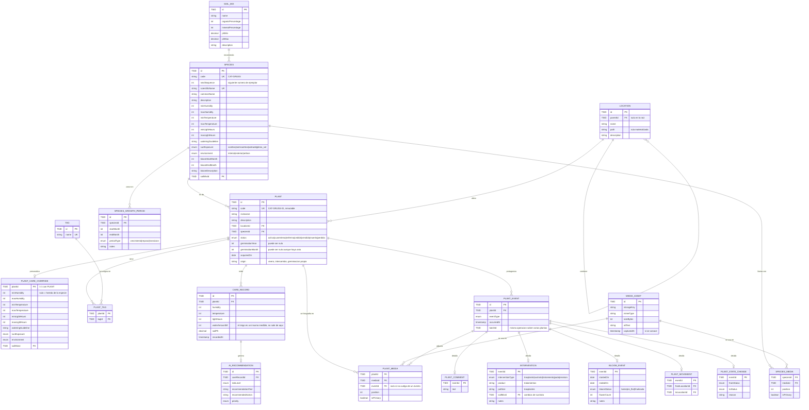

# Borrador — modelo de datos de la gestión de plantas

> **Borrador.** Es la evolución prevista del [modelo actual](modelo-datos-actual.md) para la **primera fase**: tener las plantas bien organizadas y saber qué ha pasado con cada una. Cambiará conforme se abran tickets: lo que aquí se propone es una hipótesis razonada, no una decisión cerrada. Las decisiones firmes se anotan como tales; el resto está en «Pendiente de decidir».

**Fase siguiente:** [borrador-modelo-datos-tareas.md](borrador-modelo-datos-tareas.md), que organiza el trabajo *sobre* estas plantas (tareas y alertas). Nada de aquí depende de aquello; aquello sí depende de esto.

**Alcance de la fase:** dar de alta plantas, listarlas y filtrarlas a escala, editarlas, identificarlas con un código estable, fotografiarlas, ubicarlas y moverlas, registrar medidas e intervenciones, comentarlas, anotar sus floraciones y consultar todo lo anterior en una sola cronología.

## Diagrama completo

Incluye lo que ya existe. Lo **nuevo** de esta fase está marcado en la tabla de la sección siguiente.

## Qué añade sobre el modelo actual

| Bloque | Entidades | Qué resuelve |
|---|---|---|
| Códigos | `SPECIES.code`, `SPECIES.nextSequence`, `PLANT.code` | §6 del documento de producto: identidad legible, estable e imprimible |
| Ficha del ejemplar | `PLANT` ampliada | Descripción, estado, germinación, adquisición y procedencia (§5.2, §11) |
| Herencia | `PLANT_CARE_OVERRIDE` | La historia [0.7](../user-stories/0.7-personalizar-cuidados-de-un-ejemplar.md), pendiente desde T-01 |
| Especie ampliada | `SPECIES` ampliada, `SPECIES_GROWTH_PERIOD` | Exposición, entorno, épocas de crecimiento y floración esperada (§9) |
| Espacio | `LOCATION.parentId`/`path`, `PLANT_MOVEMENT` | Jerarquía y trazabilidad del movimiento (§16), la historia [F.1](../user-stories/F.1-organizar-cactus-por-ubicacion-jerarquica.md) |
| Multimedia | `MEDIA_ASSET`, `SPECIES_MEDIA`, `PLANT_MEDIA` | Fotografías de especie y galería del ejemplar (§8) |
| Cronología | `PLANT_EVENT` y sus satélites | El historial unificado de la ficha (§7.3) |
| Intervenciones | `INTERVENTION` | Trasplante, sustrato, tratamiento y poda: lo de §13.2 que **no** es una medida |

`CARE_RECORD` y `AI_RECOMMENDATION` **no cambian**.

## Decisiones ya tomadas

* **`CareRecord` no se parte y el riego se queda dentro.** El documento de producto (§13) propone separar mediciones de acciones de cuidado; se decidió no hacerlo. Cuando el riego se automatice será un dato observado como cualquier otro, llegando por el mismo camino y con la misma cadencia que la humedad; y correlacionar agua entregada contra señales de estrés es una de las razones de ser del producto. Separarlo metería un join en la consulta más caliente del sistema. Lo que sí es entidad nueva son las **intervenciones**: irregulares, humanas, cada una con forma propia y sin unidad común, no son una cantidad en una serie temporal.
* **`CareRecord` no se renombra.** `Reading` o `Measurement` se quedarían cortos: el agua entregada no es una medida del ejemplar. `CareRecord` describe bien «registro de las condiciones de cultivo, insumos incluidos».
* **La telemetría no entra evento a evento en `PLANT_EVENT`.** Si las lecturas llegan cada minuto, inundarían el historial de la ficha. La cronología es de escala humana: comentarios, fotos, intervenciones, movimientos, floraciones. Las medidas se consultan como serie —gráfica, agregado diario— y solo asoman en la cronología cuando las mete una persona a mano.
* **`PLANT_EVENT` con satélites tipados**, no una tabla con payload JSON (perdería las invariantes que [ADR-002](../adr/ADR-002-restricciones-en-base-de-datos.md) exige en el esquema) ni una unión de quince tablas (ordenar y paginar así no escala a 2000 plantas, y [ADR-009](../adr/ADR-009-paginacion-obligatoria.md) obliga a paginar).
* **Los overrides son columnas nullable en una tabla 1-1**, no pares clave-valor: nulo significa «hereda», y así cambiar la especie se propaga sin recalcular nada. La alternativa clave-valor es más flexible pero pierde el tipado y las invariantes.
* **`batchId` en `PLANT_EVENT`** para que una operación sobre varias plantas deje su evento en cada ficha sin que el sistema pierda que fue una sola operación (§13.3).

## Pendiente de decidir

1. **Fertilización: ¿insumo o intervención?** Es dosificada como el agua —y con fertirrigación entra por la misma línea—, pero varía el producto, así que sería cantidad más referencia al producto en vez de una columna. Sin resolver.
2. **`source` en `CARE_RECORD`** (manual / sensor / riego automático) y el detalle de entrega (duración, caudal, circuito). Decidido **no añadirlo ahora**: no hay controlador y no se sabe qué campos reporta. Cuando llegue, se ensancha la fila existente; nunca una entidad `Irrigation` con el escalar duplicado.
3. **Generación del código de planta.** `SPECIES.nextSequence` con bloqueo de fila cubre el requisito de «segura ante dos altas simultáneas» del §6.2; un `MAX(...)+1` sobre `PLANT` no. Falta confirmarlo.
4. **¿Puede cambiarse el código de una especie que ya tiene plantas?** El documento recomienda que no (§6.3). Sin decidir.
5. **Estados válidos del ejemplar y sus transiciones** (§24.4). El enum del diagrama es el del documento, sin máquina de estados todavía.
6. **Fotografías**: formatos, tamaño máximo, miniaturas, EXIF, borrado real o referencia histórica, y dónde vive el binario. Es material de un ADR propio, no de este diagrama.
7. **Datos parciales.** `germinationMonth` nulo con `germinationYear` informado choca con el estilo de invariantes estrictas de [ADR-011](../adr/ADR-011-invariantes-de-negocio-en-el-dominio.md). Necesita una regla escrita, no una excepción por entidad.
8. **Vistas guardadas y columnas configurables** del inventario (§5.1): probablemente una tabla `SAVED_VIEW` con el filtro serializado. No se dibuja todavía porque puede caer al final de la fase o pasar a la siguiente.
9. **`LOCATION.path`** es redundante con `parentId`, y se propone porque abarata las dos consultas que el producto pide en todas partes: ruta completa para los breadcrumbs y recuento de descendientes. Falta decidir quién lo mantiene coherente al mover una localización.
