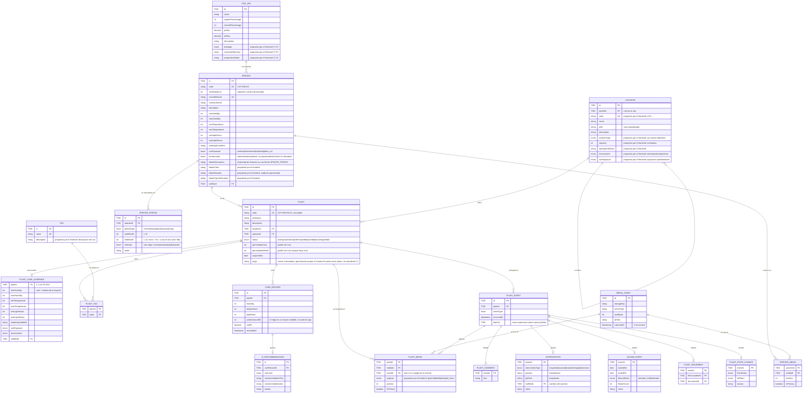

# Borrador — modelo de datos de la gestión de plantas

> **Borrador.** Es la evolución prevista del [modelo actual](modelo-datos-actual.md) para la **primera fase**: tener las plantas bien organizadas y saber qué ha pasado con cada una. Cambiará conforme se abran tickets: lo que aquí se propone es una hipótesis razonada, no una decisión cerrada. Las decisiones firmes se anotan como tales; el resto está en «Pendiente de decidir».

**Fase siguiente:** [borrador-modelo-datos-tareas.md](borrador-modelo-datos-tareas.md), que organiza el trabajo *sobre* estas plantas (tareas y alertas). Nada de aquí depende de aquello; aquello sí depende de esto.

**Revisado contra el frontend (6 de octubre de 2026).** Tras terminar el bloque 0 se cruzó este borrador con lo que enseñan las pantallas ya construidas. Los campos que el frontend pide y el borrador no tenía están en el diagrama marcados como *«propuesto por el frontend»*, y lo que cambia el esquema y no está decidido, en «Pendiente de decidir» (puntos 10 a 20). Ver también [Contraste con el frontend](#contraste-con-el-frontend).

**Alcance de la fase:** dar de alta plantas, listarlas y filtrarlas a escala, editarlas, identificarlas con un código estable, fotografiarlas, ubicarlas y moverlas, registrar medidas e intervenciones, comentarlas, anotar sus floraciones y consultar todo lo anterior en una sola cronología.

## Diagrama completo

Incluye lo que ya existe. Lo **nuevo** de esta fase está marcado en la tabla de la sección siguiente.

```mermaid
erDiagram
    SOIL_MIX ||--o{ SPECIES : "recomienda"
    SPECIES ||--o{ PLANT : "es de"
    SPECIES ||--o{ SPECIES_PERIOD : "se calendariza en"
    SPECIES ||--o{ SPECIES_MEDIA : "ilustra con"
    LOCATION ||--o{ LOCATION : "contiene"
    LOCATION ||--o{ PLANT : "ubica"
    PLANT ||--o| PLANT_CARE_OVERRIDE : "personaliza"
    PLANT ||--o{ PLANT_TAG : "tiene"
    TAG ||--o{ PLANT_TAG : "se asigna en"
    PLANT ||--o{ CARE_RECORD : "mide"
    CARE_RECORD ||--o| AI_RECOMMENDATION : "genera"
    PLANT ||--o{ PLANT_MEDIA : "se fotografia en"
    MEDIA_ASSET ||--o{ SPECIES_MEDIA : "se usa en"
    MEDIA_ASSET ||--o{ PLANT_MEDIA : "se usa en"

    PLANT ||--o{ PLANT_EVENT : "protagoniza"
    PLANT_EVENT ||--o| PLANT_COMMENT : "detalla"
    PLANT_EVENT ||--o| INTERVENTION : "detalla"
    PLANT_EVENT ||--o| BLOOM_EVENT : "detalla"
    PLANT_EVENT ||--o| PLANT_MOVEMENT : "detalla"
    PLANT_EVENT ||--o| PLANT_STATE_CHANGE : "detalla"
    PLANT_EVENT ||--o{ PLANT_MEDIA : "adjunta"

    SPECIES {
        TSID id PK
        string code UK "CAT-GRUSS"
        int nextSequence "siguiente numero de ejemplar"
        string scientificName UK
        string commonName
        string description
        int minHumidity
        int maxHumidity
        int minTemperature
        int maxTemperature
        int minLightHours
        int maxLightHours
        string wateringGuideline
        enum sunExposure "sombra|semisombra|soleado|pleno_sol"
        enum environment "interior|exterior|ambos; la estacionalidad la dice el calendario"
        string bloomDescription "el periodo de floracion es una fila de SPECIES_PERIOD"
        string bloomColor "propuesto por el frontend"
        string bloomMaturity "propuesto por el frontend: madurez aproximada"
        string bloomTypicalDuration "propuesto por el frontend"
        TSID soilMixId FK
    }

    SPECIES_PERIOD {
        TSID id PK
        TSID speciesId FK
        enum periodType "crecimiento|reposo|floracion|riego"
        int startMonth "1-12"
        int endMonth "1-12; inicio > fin = cruza el anio (nov-feb)"
        enum intensity "solo riego: escaso|moderado|abundante"
        string notes
    }

    SOIL_MIX {
        TSID id PK
        string name
        int organicPercentage
        int mineralPercentage
        decimal phMin
        decimal phMax
        string description
        enum drainage "propuesto por el frontend (T-27)"
        enum moistureRetention "propuesto por el frontend (T-27)"
        string preparationNotes "propuesto por el frontend (T-27)"
    }

    LOCATION {
        TSID id PK
        TSID parentId FK "nulo en la raiz"
        string code UK "propuesto por el frontend: LOC-..."
        string name
        string path "ruta materializada"
        string description
        enum locationType "propuesto por el frontend, sin valores definidos"
        int capacity "propuesto por el frontend: orientativa"
        string operationalNotes "propuesto por el frontend"
        enum environment "propuesto por el frontend: interior|cubierto|exterior"
        enum sunExposure "propuesto por el frontend: exposicion predominante"
    }

    PLANT {
        TSID id PK
        string code UK "CAT-GRUSS-01, inmutable"
        string nickname
        string description
        TSID locationId FK
        TSID speciesId FK
        enum status "activa|cuarentena|enferma|cedida|vendida|muerta|perdida"
        int germinationYear "puede ser nulo"
        int germinationMonth "puede ser nulo aunque haya anio"
        date acquiredOn
        string origin "vivero, intercambio, germinacion propia; el frontend lo pinta como select, ver pendiente 14"
    }

    PLANT_CARE_OVERRIDE {
        TSID plantId PK "1-1 con PLANT"
        int minHumidity "nulo = hereda de la especie"
        int maxHumidity
        int minTemperature
        int maxTemperature
        int minLightHours
        int maxLightHours
        string wateringGuideline
        enum sunExposure
        enum environment
        TSID soilMixId FK
    }

    TAG {
        TSID id PK
        string name UK
        string description "propuesto por el frontend: descripcion de uso"
    }

    PLANT_TAG {
        TSID plantId FK
        TSID tagId FK
    }

    CARE_RECORD {
        TSID id PK
        TSID plantId FK
        int humidity
        int temperature
        int lightHours
        int waterAmountMl "el riego es un insumo medible, no sale de aqui"
        decimal soilPh
        timestamp recordedAt
    }

    AI_RECOMMENDATION {
        TSID id PK
        TSID careRecordId FK
        enum riskLevel
        string recommendationText
        string recommendedAction
        enum priority
    }

    PLANT_EVENT {
        TSID id PK
        TSID plantId FK
        enum eventType
        timestamp occurredAt
        TSID batchId "misma operacion sobre varias plantas"
    }

    PLANT_COMMENT {
        TSID eventId PK
        string text
    }

    INTERVENTION {
        TSID eventId PK
        enum interventionType "trasplante|sustrato|tratamiento|poda|revision"
        string product "tratamientos"
        string potSize "trasplantes"
        TSID soilMixId FK "cambios de sustrato"
        string notes
    }

    BLOOM_EVENT {
        TSID eventId PK
        date startedOn
        date endedOn
        enum bloomStatus "boton|en_flor|finalizada"
        int flowerCount
        string notes
    }

    PLANT_MOVEMENT {
        TSID eventId PK
        TSID fromLocationId FK
        TSID toLocationId FK
    }

    PLANT_STATE_CHANGE {
        TSID eventId PK
        enum fromStatus
        enum toStatus
        string reason
    }

    MEDIA_ASSET {
        TSID id PK
        string storageKey
        string mimeType
        int sizeBytes
        string altText
        timestamp capturedAt "si se conoce"
    }

    SPECIES_MEDIA {
        TSID speciesId FK
        TSID mediaId FK
        int position
        boolean isPrimary
    }

    PLANT_MEDIA {
        TSID plantId FK
        TSID mediaId FK
        TSID eventId FK "nulo si no cuelga de un evento"
        enum purpose "propuesto por el frontend: general|detalle|etiqueta_fisica"
        int position
        boolean isPrimary
    }
```

## Qué añade sobre el modelo actual

| Bloque | Entidades | Qué resuelve |
|---|---|---|
| Códigos | `SPECIES.code`, `SPECIES.nextSequence`, `PLANT.code` | §6 del documento de producto: identidad legible, estable e imprimible |
| Ficha del ejemplar | `PLANT` ampliada | Descripción, estado, germinación, adquisición y procedencia (§5.2, §11) |
| Herencia | `PLANT_CARE_OVERRIDE` | La historia [0.7](../user-stories/0.7-personalizar-cuidados-de-un-ejemplar.md), pendiente desde T-01 |
| Especie ampliada | `SPECIES` ampliada, `SPECIES_PERIOD` | Exposición, entorno y calendario anual —crecimiento, reposo, floración y riego— (§9) |
| Espacio | `LOCATION.parentId`/`path`, `PLANT_MOVEMENT` y, **a petición del frontend**, `code`, `locationType`, `capacity`, `operationalNotes`, `environment` y `sunExposure` | Jerarquía y trazabilidad del movimiento (§16), la historia [F.1](../user-stories/F.1-organizar-cactus-por-ubicacion-jerarquica.md), y la ficha de localización del prototipo |
| Multimedia | `MEDIA_ASSET`, `SPECIES_MEDIA`, `PLANT_MEDIA` | Fotografías de especie y galería del ejemplar (§8) |
| Cronología | `PLANT_EVENT` y sus satélites | El historial unificado de la ficha (§7.3) |
| Intervenciones | `INTERVENTION` | Trasplante, sustrato, tratamiento y poda: lo de §13.2 que **no** es una medida |

`CARE_RECORD` y `AI_RECOMMENDATION` **no cambian**.

## Hecho: cuidados propios del ejemplar (7 oct 2026, `cuidados-por-ejemplar`)

`PLANT_CARE_OVERRIDE` **no se creó como tabla 1-1**: los ocho valores opcionales son columnas de `PLANT` con prefijo `care_` (nulo = hereda). La asociación 1-1 inversa no se carga perezosamente en Hibernate, y cada planta de un listado habría disparado una consulta más; la semántica es la misma. Cambiar la especie **conserva** los valores propios y se revalida el perfil efectivo. Ya está en el [modelo actual](modelo-datos-actual.md).

## Contraste con el frontend

Lo que se encontró al cruzar este borrador con las pantallas del bloque 0. Aquí solo se recoge el **qué**; lo que cambia el esquema y no está decidido va a «Pendiente de decidir».

**Campos que las pantallas piden y el borrador no tenía** (ya añadidos al diagrama como *propuestos por el frontend*): código, tipo, capacidad, notas, entorno y exposición de la localización; color, madurez y duración habitual de la floración de la especie; drenaje, retención y notas de preparación del sustrato; descripción de la etiqueta; propósito de la fotografía de planta.

**Una contradicción con una decisión ya tomada.** La cronología de la ficha tiene, **solo en la maqueta (T-20)**, un tipo de evento «Riego» con su cantidad en ml. Se decidió que **el riego vive dentro de `CareRecord`** y no en `PLANT_EVENT`, y la ficha ya deriva «Último riego» de las lecturas reales. El evento «Riego» de la maqueta debe leerse como **una lectura con `waterAmountMl`**, no como un tipo de evento propio. Los tipos que sí son eventos son los del diagrama: comentario, intervención, floración, movimiento y cambio de estado.

**Dos huecos que el borrador no cierra:**

* **`INTERVENTION` no aparece en ninguna pantalla.** Es una entidad núcleo —trasplante, sustrato, tratamiento, poda— y el frontend solo la insinúa a través de dos tipos de *tarea* («Cambio de maceta», «Poda de raíces»). Falta decir qué evento crea cada tipo de tarea al completarse. Ver el [borrador de tareas](borrador-modelo-datos-tareas.md).
* **El formulario de lecturas tiene un campo «Observación»** (maqueta, T-20) que `CARE_RECORD` no tiene. Si se admite, es un `PLANT_COMMENT` enlazado a la lectura, no una columna: el borrador decide que la lectura es una serie de medidas.

## Decisiones ya tomadas

* **`CareRecord` no se parte y el riego se queda dentro.** El documento de producto (§13) propone separar mediciones de acciones de cuidado; se decidió no hacerlo. Cuando el riego se automatice será un dato observado como cualquier otro, llegando por el mismo camino y con la misma cadencia que la humedad; y correlacionar agua entregada contra señales de estrés es una de las razones de ser del producto. Separarlo metería un join en la consulta más caliente del sistema. Lo que sí es entidad nueva son las **intervenciones**: irregulares, humanas, cada una con forma propia y sin unidad común, no son una cantidad en una serie temporal.
* **`CareRecord` no se renombra.** `Reading` o `Measurement` se quedarían cortos: el agua entregada no es una medida del ejemplar. `CareRecord` describe bien «registro de las condiciones de cultivo, insumos incluidos».
* **La telemetría no entra evento a evento en `PLANT_EVENT`.** Si las lecturas llegan cada minuto, inundarían el historial de la ficha. La cronología es de escala humana: comentarios, fotos, intervenciones, movimientos, floraciones. Las medidas se consultan como serie —gráfica, agregado diario— y solo asoman en la cronología cuando las mete una persona a mano.
* **`PLANT_EVENT` con satélites tipados**, no una tabla con payload JSON (perdería las invariantes que [ADR-002](../adr/ADR-002-restricciones-en-base-de-datos.md) exige en el esquema) ni una unión de quince tablas (ordenar y paginar así no escala a 2000 plantas, y [ADR-009](../adr/ADR-009-paginacion-obligatoria.md) obliga a paginar).
* **Los overrides son columnas nullable en una tabla 1-1**, no pares clave-valor: nulo significa «hereda», y así cambiar la especie se propaga sin recalcular nada. La alternativa clave-valor es más flexible pero pierde el tipado y las invariantes.
* **`batchId` en `PLANT_EVENT`** para que una operación sobre varias plantas deje su evento en cada ficha sin que el sistema pierda que fue una sola operación (§13.3).

* **El entorno de la especie tiene tres valores —`interior|exterior|ambos`— y no existe «Estacional»** (6 oct 2026). La estacionalidad ya la expresa el calendario anual; un cuarto valor duplicaría el dato en dos sitios. Se retira «Estacional» del formulario de especie. Resuelve la pregunta 5 del §24 **para la especie**; la pregunta de si una *planta* concreta puede moverse de entorno por estación es otra y sigue abierta.
* **El calendario anual de la especie es una sola tabla de periodos por tipo** (6 oct 2026): `SPECIES_PERIOD` con tipo `crecimiento|reposo|floracion|riego`, mes de inicio y de fin, e `intensity` solo para riego. Un periodo que **cruza el año se guarda con inicio > fin** (noviembre a febrero), con `CHECK` de rango 1–12 en el esquema. La floración deja de vivir en columnas de `SPECIES` y pasa a ser una fila más; `transicion` desaparece del enum porque nadie la pide.

## Pendiente de decidir

1. **Fertilización: ¿insumo o intervención?** Es dosificada como el agua —y con fertirrigación entra por la misma línea—, pero varía el producto, así que sería cantidad más referencia al producto en vez de una columna. Sin resolver.
2. **`source` en `CARE_RECORD`** (manual / sensor / riego automático) y el detalle de entrega (duración, caudal, circuito). Decidido **no añadirlo ahora**: no hay controlador y no se sabe qué campos reporta. Cuando llegue, se ensancha la fila existente; nunca una entidad `Irrigation` con el escalar duplicado.
3. ~~Generación del código de planta.~~ **Hecha (7 oct 2026, `codigos-de-inventario`):** `SPECIES.nextSequence` con bloqueo de fila; ya está en el [modelo actual](modelo-datos-actual.md).
4. ~~¿Puede cambiarse el código de una especie que ya tiene plantas?~~ **Resuelta (7 oct 2026): no**, y es **obligatorio al dar de alta**: lo escribe una persona, no se propone. Se puede corregir mientras la especie no tenga ejemplares.
5. ~~Estados válidos del ejemplar y sus transiciones~~ **Resuelta (7 oct 2026, `ficha-del-ejemplar`):** siete estados —en curso: `activa`, `cuarentena`, `enferma`; finales: `cedida`, `vendida`, `muerta`, `perdida`—; entre en curso libres, a un final libre, y **de un final solo a `activa` con motivo obligatorio**. El cambio se guarda en `plant_status_change` (no como satélite de `PLANT_EVENT`, que llega con T-20); ya está en el [modelo actual](modelo-datos-actual.md).
6. **Fotografías**: formatos, tamaño máximo, miniaturas, EXIF, borrado real o referencia histórica, y dónde vive el binario. Es material de un ADR propio, no de este diagrama.
7. ~~Datos parciales.~~ **Resuelta (7 oct 2026):** una sola regla —el mes solo vale con año—, con `CHECK` en el esquema y `require` en el dominio; un año sin mes significa «en algún momento de ese año» y la ficha lo cuenta como edad aproximada.
8. **Vistas guardadas y columnas configurables** del inventario (§5.1): probablemente una tabla `SAVED_VIEW` con el filtro serializado. No se dibuja todavía porque puede caer al final de la fase o pasar a la siguiente.
9. **`LOCATION.path`** es redundante con `parentId`, y se propone porque abarata las dos consultas que el producto pide en todas partes: ruta completa para los breadcrumbs y recuento de descendientes. Falta decidir quién lo mantiene coherente al mover una localización.
10. ~~¿Existe el entorno «Estacional»?~~ **Resuelta (6 oct 2026):** no, el entorno queda en tres valores. Sigue abierto si la localización (`interior|cubierto|exterior`) y la especie deben usar el mismo conjunto: son conceptos distintos —una cubre el sitio, la otra la tolerancia de la planta— y de momento se mantienen separados.
11. ~~Calendario anual de la especie~~ **Resuelta (6 oct 2026) y construida (7 oct, `especie-ampliada`, `V10`):** una sola tabla `SPECIES_PERIOD` por tipo, con el cruce de año como inicio > fin. El entorno quedó en **tres valores** (decisión del usuario, §9.3 resuelta: sin «estacional») y «soleado»/«pleno sol» se distinguen por **definición funcional en la interfaz**, sin umbrales (§24.6 resuelta). Los datos de floración quedaron como columnas de `SPECIES`; `description` pasó a opcional.
12. **Grupos de cultivo de especies** («Pleno sol», «Sensibles al frío: mínima > 8 °C», «Crecimiento invernal»). Son filtros guardados, pero sobre **especies**, y el punto 8 solo contempla vistas de plantas. Depende de si los grupos son manuales o dinámicos (§24.11).
13. **«Año de cultivo» en la ficha de especie.** No está claro qué dato es ni de dónde sale; hasta saberlo, no tiene campo.
14. ~~Procedencia del ejemplar: ¿texto libre o enum?~~ **Resuelta (7 oct 2026): lista cerrada** (`vivero`, `intercambio`, `germinacion_propia`, `compra`, `regalo`, `otro`) **más una nota libre**.
15. **Componentes del sustrato.** El frontend muestra una lista de «componentes orientativos» con su proporción. Es una lista de longitud variable: ¿tabla `SOIL_MIX_COMPONENT` o descripción de texto? Lo decide T-27.
16. **Código de las localizaciones.** El frontend muestra `LOC-···`, pero T-15 solo cubre códigos de especie y de ejemplar. Falta un ticket que lo cubra o retirar el código de la maqueta.
17. **Valores de `LOCATION.locationType`.** El select del formulario existe y está vacío. Sin valores no se puede hacer un enum (ADR-007).
18. **Texto de la etiqueta.** Decidir si `TAG.description` es un campo opcional y quién lo edita.
19. **Propósito de la foto de planta**: los tres valores (`general`, `detalle`, `etiqueta_fisica`) salen del formulario de alta del frontend y no están confirmados como enum.
20. **Configuración de la aplicación** (formato de códigos, unidades, umbrales de alerta, ajustes de IA). Ningún borrador la modela y ningún ticket la recoge. El **formato de código** sí toca este borrador: si el prefijo y los dígitos son configurables, `SPECIES.code` y `PLANT.code` guardan el texto ya compuesto y el cambio de formato no puede reescribir los existentes.
