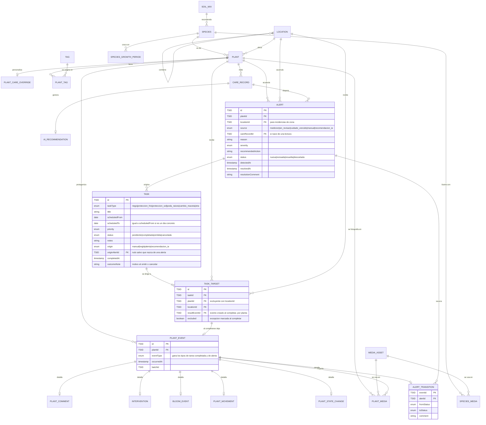

# Borrador — modelo de datos del trabajo: tareas y alertas

> **Borrador.** Es la evolución prevista del [borrador de gestión](borrador-modelo-datos-gestion.md) para la **segunda fase**: una vez que las plantas están organizadas, organizar el trabajo que hay que hacer con ellas. Cambiará conforme se abran tickets.

**Fase anterior:** [borrador-modelo-datos-gestion.md](borrador-modelo-datos-gestion.md). Esta fase **depende** de aquella: una tarea se dirige a plantas y a localizaciones jerárquicas, y al completarse deja su rastro en la cronología del ejemplar. No tiene sentido empezar por aquí.

**Alcance de la fase:** crear y programar tareas manuales, dirigirlas a una planta, a varias o a una localización, verlas en agenda y calendario, reprogramarlas, completarlas registrando el trabajo real, y gestionar alertas hasta su resolución. El Dashboard operativo se sirve de todo esto y no añade tablas propias.

## Diagrama

Las entidades de la fase anterior aparecen en las relaciones para que se vea el modelo completo, pero **sin sus atributos**: están detalladas en el [borrador de gestión](borrador-modelo-datos-gestion.md) y no se copian aquí para no mantener dos versiones que acaben desincronizadas. Lo que lleva atributos es lo nuevo o lo que cambia.

## Qué añade sobre la fase anterior

| Entidad | Qué resuelve |
|---|---|
| `TASK` | El trabajo pendiente: tipo, título, periodo previsto, prioridad, estado y origen (§14.3) |
| `TASK_TARGET` | El destino, que puede ser una planta, varias o una localización (§14.4), y el enlace con lo que se registró al completar |
| `ALERT` | La incidencia con ciclo de vida propio, no un color sobre una recomendación (§17) |
| `ALERT_TRANSITION` | Que la apertura y la resolución de una alerta aparezcan en la cronología del ejemplar |

Nada de la fase anterior cambia, salvo que `PLANT_EVENT.eventType` gana los tipos nuevos.

## Decisiones ya tomadas

* **Tarea, cuidado y alerta son tres cosas distintas.** La tarea es una intención; el cuidado es un hecho ocurrido; la alerta es una situación que requiere atención. Crear una tarea **no** escribe en el historial. Completarla sí: crea el `PLANT_EVENT` correspondiente en cada planta afectada y lo enlaza desde `TASK_TARGET.resultEventId`.
* **«Vencida» no es un estado almacenado**, es calculado: pendiente y pasada su fecha o el final de su periodo (§14.3). Guardarlo obligaría a un proceso que lo mantenga al día y a que el usuario lo pudiera seleccionar a mano, que es justo lo que el documento descarta.
* **El destino va en tabla aparte**, no en tres columnas nullable de `TASK`. Una tarea de grupo necesita además saber, planta a planta, qué se registró y qué se excluyó al completar; eso solo cabe por destino.
* **Una automatización futura podrá crear tareas, nunca marcarlas como realizadas.** Por eso `origin` es un campo desde el primer día aunque hoy solo tome el valor `manual`: las reglas futuras crean tareas normales que el usuario encuentra en la misma agenda (§14.7).
* **El Dashboard no añade tablas.** Es una lectura sobre tareas, alertas y la cronología.

## Pendiente de decidir

1. **Una tarea sobre una localización, ¿afecta a las plantas que contenía al crearla o a las que contiene al completarla?** (§24.15). Es la decisión con más consecuencias del bloque: determina si `TASK_TARGET` se materializa en plantas al crear la tarea o al cerrarla.
2. **¿Día exacto, periodo, o ambos desde el principio?** (§24.14). El diagrama asume ambos con `scheduledFrom`/`scheduledTo`, que es lo barato, pero no está confirmado.
3. **¿Hace falta tarea recurrente manual en la primera versión**, aunque no existan reglas automáticas? (§24.17). Si la respuesta es sí, aparece una entidad de recurrencia que aquí no está.
4. **¿Completar una tarea crea siempre un cuidado**, o hay tareas administrativas sin efecto en el historial? (§24.18). De esto depende que `TASK_TARGET.resultEventId` pueda ser nulo con normalidad o sea la excepción.
5. **¿El tipo `otra` basta o hacen falta tipos configurables?** (§24.16). El documento pide empezar pequeño y validar; el enum del diagrama sigue esa recomendación.
6. **Qué eventos generan alertas automáticamente** (§24.10), y si la detección corre en un proceso programado o al escribir cada lectura.
7. **La relación alerta ↔ tarea** está resuelta como `TASK.originAlertId`, que asume una alerta por tarea. Si una tarea puede atender varias alertas a la vez, se convierte en tabla de unión.
8. **Multiusuario.** El documento menciona autoría y responsable en tareas, comentarios y alertas «cuando exista multiusuario». No hay autenticación todavía, así que ningún campo de autor aparece en el diagrama; entrarán todos a la vez cuando esa decisión se tome.
