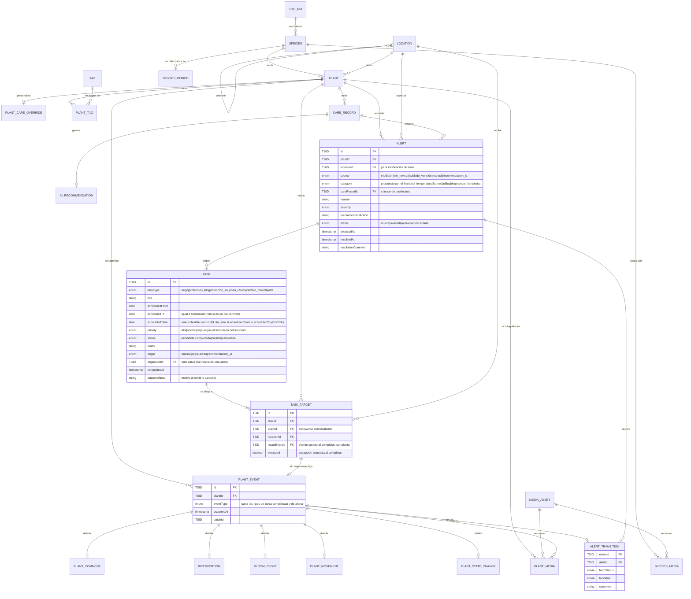

# Borrador — modelo de datos del trabajo: tareas y alertas

> **Borrador.** Es la evolución prevista del [borrador de gestión](borrador-modelo-datos-gestion.md) para la **segunda fase**: una vez que las plantas están organizadas, organizar el trabajo que hay que hacer con ellas. Cambiará conforme se abran tickets.

**Fase anterior:** [borrador-modelo-datos-gestion.md](borrador-modelo-datos-gestion.md). Esta fase **depende** de aquella: una tarea se dirige a plantas y a localizaciones jerárquicas, y al completarse deja su rastro en la cronología del ejemplar. No tiene sentido empezar por aquí.

**Revisado contra el frontend (6 de octubre de 2026).** Tras terminar el bloque 0 se cruzó este borrador con la maqueta de tareas, alertas y Dashboard. Lo que las pantallas piden y el borrador no tenía está marcado como *«propuesto por el frontend»* en el diagrama; lo que cambia el esquema y no está decidido, en «Pendiente de decidir» (puntos 9 a 15). Ver [Contraste con el frontend](#contraste-con-el-frontend).

**Alcance de la fase:** crear y programar tareas manuales, dirigirlas a una planta, a varias o a una localización, verlas en agenda y calendario, reprogramarlas, completarlas registrando el trabajo real, y gestionar alertas hasta su resolución. El Dashboard operativo se sirve de todo esto y no añade tablas propias.

## Diagrama

Las entidades de la fase anterior aparecen en las relaciones para que se vea el modelo completo, pero **sin sus atributos**: están detalladas en el [borrador de gestión](borrador-modelo-datos-gestion.md) y no se copian aquí para no mantener dos versiones que acaben desincronizadas. Lo que lleva atributos es lo nuevo o lo que cambia.

```mermaid
erDiagram
    SOIL_MIX ||--o{ SPECIES : "recomienda"
    SPECIES ||--o{ PLANT : "es de"
    SPECIES ||--o{ SPECIES_PERIOD : "se calendariza en"
    SPECIES ||--o{ SPECIES_MEDIA : "ilustra con"
    LOCATION ||--o{ LOCATION : "contiene"
    LOCATION ||--o{ PLANT : "ubica"
    PLANT ||--o| PLANT_CARE_OVERRIDE : "personaliza"
    PLANT ||--o{ PLANT_TAG : "tiene"
    TAG ||--o{ PLANT_TAG : "se asigna en"
    PLANT ||--o{ CARE_RECORD : "mide"
    CARE_RECORD ||--o| AI_RECOMMENDATION : "genera"
    PLANT ||--o{ PLANT_MEDIA : "se fotografia en"
    MEDIA_ASSET ||--o{ SPECIES_MEDIA : "se usa en"
    MEDIA_ASSET ||--o{ PLANT_MEDIA : "se usa en"
    PLANT ||--o{ PLANT_EVENT : "protagoniza"
    PLANT_EVENT ||--o| PLANT_COMMENT : "detalla"
    PLANT_EVENT ||--o| INTERVENTION : "detalla"
    PLANT_EVENT ||--o| BLOOM_EVENT : "detalla"
    PLANT_EVENT ||--o| PLANT_MOVEMENT : "detalla"
    PLANT_EVENT ||--o| PLANT_STATE_CHANGE : "detalla"
    PLANT_EVENT ||--o{ PLANT_MEDIA : "adjunta"

    TASK ||--|{ TASK_TARGET : "se dirige a"
    PLANT ||--o{ TASK_TARGET : "recibe"
    LOCATION ||--o{ TASK_TARGET : "recibe"
    TASK_TARGET ||--o| PLANT_EVENT : "al completarse deja"
    ALERT ||--o{ TASK : "origina"
    PLANT ||--o{ ALERT : "acumula"
    LOCATION ||--o{ ALERT : "acumula"
    CARE_RECORD ||--o{ ALERT : "dispara"
    PLANT_EVENT ||--o| ALERT_TRANSITION : "detalla"
    ALERT ||--o{ ALERT_TRANSITION : "recorre"

    TASK {
        TSID id PK
        enum taskType "riego|proteccion_frio|proteccion_sol|poda_raices|cambio_maceta|otra"
        string title
        date scheduledFrom
        date scheduledTo "igual a scheduledFrom si es un dia concreto"
        time scheduledTime "nulo = flexible dentro del dia; solo si scheduledFrom = scheduledTo (CHECK)"
        enum priority "alta|normal|baja segun el formulario del frontend"
        enum status "pendiente|completada|omitida|cancelada"
        string notes
        enum origin "manual|regla|alerta|recomendacion_ia"
        TSID originAlertId FK "nulo salvo que nazca de una alerta"
        timestamp completedAt
        string outcomeNote "motivo al omitir o cancelar"
    }

    TASK_TARGET {
        TSID id PK
        TSID taskId FK
        TSID plantId FK "excluyente con locationId"
        TSID locationId FK
        TSID resultEventId FK "evento creado al completar, por planta"
        boolean excluded "excepcion marcada al completar"
    }

    ALERT {
        TSID id PK
        TSID plantId FK
        TSID locationId FK "para incidencias de zona"
        enum source "medicion|sin_revisar|cuidado_vencido|manual|recomendacion_ia"
        enum category "propuesto por el frontend: temperatura|humedad|luz|riego|seguimiento|otra"
        TSID careRecordId FK "si nace de una lectura"
        string reason
        enum severity
        string recommendedAction
        enum status "nueva|revisada|resuelta|descartada"
        timestamp detectedAt
        timestamp resolvedAt
        string resolutionComment
    }

    ALERT_TRANSITION {
        TSID eventId PK
        TSID alertId FK
        enum fromStatus
        enum toStatus
        string comment
    }

    PLANT_EVENT {
        TSID id PK
        TSID plantId FK
        enum eventType "gana los tipos de tarea completada y de alerta"
        timestamp occurredAt
        TSID batchId
    }

```

## Qué añade sobre la fase anterior

| Entidad | Qué resuelve |
|---|---|
| `TASK` | El trabajo pendiente: tipo, título, periodo previsto, prioridad, estado y origen (§14.3) |
| `TASK_TARGET` | El destino, que puede ser una planta, varias o una localización (§14.4), y el enlace con lo que se registró al completar |
| `ALERT` | La incidencia con ciclo de vida propio, no un color sobre una recomendación (§17) |
| `ALERT_TRANSITION` | Que la apertura y la resolución de una alerta aparezcan en la cronología del ejemplar |

Nada de la fase anterior cambia, salvo que `PLANT_EVENT.eventType` gana los tipos nuevos.

## Contraste con el frontend

Lo que se encontró al cruzar este borrador con las pantallas del bloque 0. Aquí solo se recoge el **qué**; lo que cambia el esquema y no está decidido va a «Pendiente de decidir».

**Lo que cuadra:** los seis tipos de tarea, la prioridad, la fecha, el cálculo de «vencida», el origen manual y los cuatro estados de la alerta con su transición.

**Lo que el frontend pide y el borrador no tenía** (ya añadido al diagrama como *propuesto*):

* **La hora de la tarea.** El borrador solo guarda fechas; las pantallas muestran «09:00» o «Flexible» y el Dashboard cuenta las tareas «sin hora fija».
* **La categoría de la alerta** (temperatura, humedad, seguimiento, riego). `ALERT.source` es de dónde nace la alerta y es otro eje distinto: es lo que alimentaría el filtro «Origen», mientras que la categoría es el rótulo de la tarjeta. Sin ella, «Seguimiento» no tiene dónde vivir.

**Lo que el frontend dibuja y el borrador no sabe expresar:**

* **«Selección guardada» como destino de una tarea** («6 plantas · selección guardada»). `TASK_TARGET` apunta a una planta o a una localización; una selección se materializaría en filas por planta, pero se perdería que era *una* selección con nombre.
* **«Toda la colección» como destino** (es el valor por defecto del formulario). No es una planta ni una localización, y el borrador de gestión no tiene fila para la raíz de la jerarquía.
* **La relación entre el tipo de tarea y el evento que deja al completarse.** El borrador dice que completar crea un `PLANT_EVENT`, pero no cuál. «Riego» debería escribir una medida en `CARE_RECORD` (el riego vive allí); «Cambio de maceta» y «Poda de raíces» deberían crear una `INTERVENTION`; «Protección» y «Otra» no tienen contraparte clara. Es la pregunta 18 con más consecuencias de las que tenía.

**Lo que el frontend no tiene y el modelo sí:** los estados `omitida` y `cancelada`, el motivo al omitir, las notas guardadas (el formulario las pide y el tipo `Task` no las lleva), el origen y la tarea que nace de una alerta, la fecha de completado y la resolución de una alerta con su comentario. La maqueta tampoco ofrece «Resolver» en una alerta, solo «Revisar» y «Descartar». Todo esto lo cubre T-22 y T-23 al construir el backend; no es una discrepancia de modelo sino de alcance de la maqueta.

## Decisiones ya tomadas

* **Tarea, cuidado y alerta son tres cosas distintas.** La tarea es una intención; el cuidado es un hecho ocurrido; la alerta es una situación que requiere atención. Crear una tarea **no** escribe en el historial. Completarla sí: crea el `PLANT_EVENT` correspondiente en cada planta afectada y lo enlaza desde `TASK_TARGET.resultEventId`.
* **«Vencida» no es un estado almacenado**, es calculado: pendiente y pasada su fecha o el final de su periodo (§14.3). Guardarlo obligaría a un proceso que lo mantenga al día y a que el usuario lo pudiera seleccionar a mano, que es justo lo que el documento descarta.
* **El destino va en tabla aparte**, no en tres columnas nullable de `TASK`. Una tarea de grupo necesita además saber, planta a planta, qué se registró y qué se excluyó al completar; eso solo cabe por destino.
* **Una automatización futura podrá crear tareas, nunca marcarlas como realizadas.** Por eso `origin` es un campo desde el primer día aunque hoy solo tome el valor `manual`: las reglas futuras crean tareas normales que el usuario encuentra en la misma agenda (§14.7).
* **El Dashboard no añade tablas.** Es una lectura sobre tareas, alertas y la cronología.

* **La tarea lleva hora, pero solo si es de un día exacto** (6 oct 2026). `scheduledTime` nulo significa «flexible dentro del día», y solo puede informarse cuando `scheduledFrom = scheduledTo`, con un `CHECK` en el esquema (ADR-002): un periodo de varios días con una hora concreta no tiene sentido.
* **Una «selección» no se guarda; solo se guardan las plantas** (6 oct 2026). Las acciones por lote se hacen en el frontend: se marcan plantas en el inventario y «Crear tarea» arrastra esa selección al formulario. La relación entre tareas y plantas es **N:M a través de `TASK_TARGET`**, que ya tiene una fila por planta; no hace falta ninguna entidad de selección ni `SAVED_VIEW` para las tareas. La etiqueta «selección guardada» de la maqueta pasa a ser «N plantas».

## Pendiente de decidir

1. **Una tarea sobre una localización, ¿afecta a las plantas que contenía al crearla o a las que contiene al completarla?** (§24.15). Es la decisión con más consecuencias del bloque: determina si `TASK_TARGET` se materializa en plantas al crear la tarea o al cerrarla.
2. **¿Día exacto, periodo, o ambos desde el principio?** (§24.14). El diagrama asume ambos con `scheduledFrom`/`scheduledTo`, que es lo barato, pero no está confirmado.
3. **¿Hace falta tarea recurrente manual en la primera versión**, aunque no existan reglas automáticas? (§24.17). Si la respuesta es sí, aparece una entidad de recurrencia que aquí no está.
4. **¿Completar una tarea crea siempre un cuidado**, o hay tareas administrativas sin efecto en el historial? (§24.18). De esto depende que `TASK_TARGET.resultEventId` pueda ser nulo con normalidad o sea la excepción.
5. **¿El tipo `otra` basta o hacen falta tipos configurables?** (§24.16). El documento pide empezar pequeño y validar; el enum del diagrama sigue esa recomendación.
6. **Qué eventos generan alertas automáticamente** (§24.10), y si la detección corre en un proceso programado o al escribir cada lectura.
7. **La relación alerta ↔ tarea** está resuelta como `TASK.originAlertId`, que asume una alerta por tarea. Si una tarea puede atender varias alertas a la vez, se convierte en tabla de unión.
8. **Multiusuario.** El documento menciona autoría y responsable en tareas, comentarios y alertas «cuando exista multiusuario». No hay autenticación todavía, así que ningún campo de autor aparece en el diagrama; entrarán todos a la vez cuando esa decisión se tome.
9. ~~¿La tarea lleva hora?~~ **Resuelta (6 oct 2026):** sí, solo en día exacto, con `CHECK`. Ver «Decisiones ya tomadas».
10. ~~«Selección guardada» como destino~~ **Resuelta (6 oct 2026):** no se guarda ninguna selección; la tarea guarda las plantas en `TASK_TARGET` (N:M). Ver «Decisiones ya tomadas».
11. **«Toda la colección» como destino.** Opciones: una localización raíz real que contiene todo, o una bandera en la tarea. La primera obliga a que la jerarquía tenga raíz explícita, que el borrador de gestión no tiene.
12. **Qué evento deja cada tipo de tarea al completarse.** Propuesta a validar: riego → lectura con `waterAmountMl`; cambio de maceta → `INTERVENTION(trasplante)`; poda de raíces → `INTERVENTION(poda)`; protección frente al frío o al sol y «otra» → sin evento propio o comentario. Si algún tipo no deja nada, `TASK_TARGET.resultEventId` pasa a ser nulo con normalidad (pregunta 4).
13. **Categoría de la alerta como enum o texto libre.** El frontend la usa como texto libre; un enum cerrado obliga a decidir los valores (ADR-007) y la pregunta 6 sobre qué eventos generan alertas.
14. **Valores de la prioridad.** Dos formularios del frontend discrepan (dos y tres niveles). Propuesto `alta|normal|baja`; confirmar.
15. **Umbrales de las reglas de alerta** («planta sin revisar: 30 días», «tarea vencida: 2 días», «temperatura crítica: 2 horas»). El frontend los muestra como configuración, y ningún borrador los modela. Son la entrada de la pregunta 6; si son configurables, necesitan una tabla de ajustes que hoy no existe.
