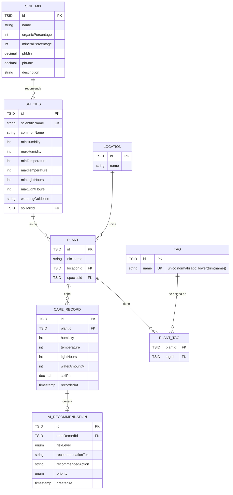

# Modelo de datos actual

Lo que hay **hoy en las migraciones** (`backend/src/main/resources/db/migration/`, hasta `V6`). Este archivo describe lo construido, no lo previsto: se actualiza al archivar cada change que toque el esquema.

Para la evolución prevista ver [borrador-modelo-datos-gestion.md](borrador-modelo-datos-gestion.md) y, después de ese, [borrador-modelo-datos-tareas.md](borrador-modelo-datos-tareas.md).

Descripción detallada de campos en el [README](../../README.md#3-modelo-de-datos).

## Reglas que el diagrama no muestra

* **Auditoría ([ADR-010](../adr/ADR-010-fechas-y-auditoria.md)).** Toda tabla —`plant_tag` incluida— tiene `created_at` y `updated_at` de tipo `timestamptz`. No se pintan en el diagrama porque son universales. Las sella `AuditingListener` desde la aplicación; el `DEFAULT now()` es la red de seguridad que exige [ADR-002](../adr/ADR-002-restricciones-en-base-de-datos.md).
* **Toda fecha es un `Instant` sobre `timestamptz`**, con la sesión JDBC en UTC.
* **Las claves primarias son TSID** (`bigint` ordenado por tiempo, generado en la aplicación — [ADR-003](../adr/ADR-003-tsid-como-clave-primaria.md)) y viajan al API como cadena decimal ([ADR-008](../adr/ADR-008-identificadores-tipados.md)).
* **Las invariantes están además en el esquema** como `CHECK` y `UNIQUE` ([ADR-002](../adr/ADR-002-restricciones-en-base-de-datos.md)): porcentajes de `soil_mix` que suman 100, rangos `min <= max`, humedad 0–100, horas de luz 0–24, temperatura plausible, riego no negativo, unicidad del nombre científico y una sola recomendación por lectura.
* **`care_record` exige al menos una de sus cinco medidas.** Una lectura completamente vacía se rechaza con `400`; es una regla deliberada y su revisión está atada a la ingesta automática, no antes.
* **Los enums (`riskLevel`, `priority`) se persisten por su `value` explícito** con un `AttributeConverter`, nunca con `@Enumerated` ([ADR-007](../adr/ADR-007-enums-de-dominio.md)).

## Lo que este modelo todavía no soporta

El [documento de producto](../producto/definicion-funcional-y-ux.md) da por supuestas varias cosas que aquí no existen: códigos de inventario estables, fotografías, descripción y estado del ejemplar, germinación, localizaciones jerárquicas, comentarios, floraciones, intervenciones, cronología unificada, tareas y alertas. Están repartidas entre los dos borradores enlazados arriba.

La personalización de cuidados por ejemplar ([0.7](../user-stories/0.7-personalizar-cuidados-de-un-ejemplar.md)) sigue sin implementar; el borrador de gestión propone cómo.
