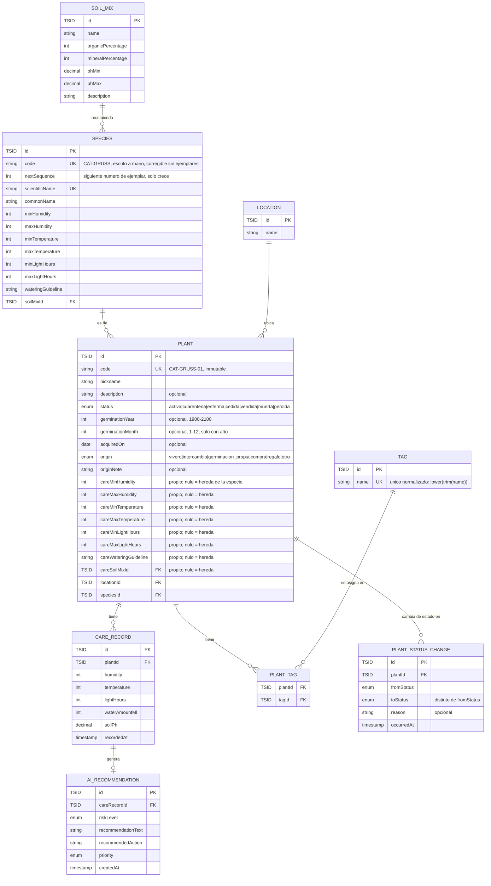

# Modelo de datos actual

Lo que hay **hoy en las migraciones** (`backend/src/main/resources/db/migration/`, hasta `V9`). Este archivo describe lo construido, no lo previsto: se actualiza al archivar cada change que toque el esquema.

Para la evolución prevista ver [borrador-modelo-datos-gestion.md](borrador-modelo-datos-gestion.md) y, después de ese, [borrador-modelo-datos-tareas.md](borrador-modelo-datos-tareas.md).

Descripción detallada de campos en el [README](../../README.md#3-modelo-de-datos).

```mermaid
erDiagram
    SOIL_MIX ||--o{ SPECIES : "recomienda"
    SPECIES ||--o{ PLANT : "es de"
    LOCATION ||--o{ PLANT : "ubica"
    PLANT ||--o{ CARE_RECORD : "tiene"
    CARE_RECORD ||--o| AI_RECOMMENDATION : "genera"
    PLANT ||--o{ PLANT_TAG : "tiene"
    PLANT ||--o{ PLANT_STATUS_CHANGE : "cambia de estado en"
    TAG ||--o{ PLANT_TAG : "se asigna en"

    SOIL_MIX {
        TSID id PK
        string name
        int organicPercentage
        int mineralPercentage
        decimal phMin
        decimal phMax
        string description
    }

    SPECIES {
        TSID id PK
        string code UK "CAT-GRUSS, escrito a mano, corregible sin ejemplares"
        int nextSequence "siguiente numero de ejemplar, solo crece"
        string scientificName UK
        string commonName
        int minHumidity
        int maxHumidity
        int minTemperature
        int maxTemperature
        int minLightHours
        int maxLightHours
        string wateringGuideline
        TSID soilMixId FK
    }

    LOCATION {
        TSID id PK
        string name
    }

    PLANT {
        TSID id PK
        string code UK "CAT-GRUSS-01, inmutable"
        string nickname
        string description "opcional"
        enum status "activa|cuarentena|enferma|cedida|vendida|muerta|perdida"
        int germinationYear "opcional, 1900-2100"
        int germinationMonth "opcional, 1-12, solo con año"
        date acquiredOn "opcional"
        enum origin "vivero|intercambio|germinacion_propia|compra|regalo|otro"
        string originNote "opcional"
        int careMinHumidity "propio; nulo = hereda de la especie"
        int careMaxHumidity "propio; nulo = hereda"
        int careMinTemperature "propio; nulo = hereda"
        int careMaxTemperature "propio; nulo = hereda"
        int careMinLightHours "propio; nulo = hereda"
        int careMaxLightHours "propio; nulo = hereda"
        string careWateringGuideline "propio; nulo = hereda"
        TSID careSoilMixId FK "propio; nulo = hereda"
        TSID locationId FK
        TSID speciesId FK
    }

    PLANT_STATUS_CHANGE {
        TSID id PK
        TSID plantId FK
        enum fromStatus
        enum toStatus "distinto de fromStatus"
        string reason "opcional"
        timestamp occurredAt
    }

    TAG {
        TSID id PK
        string name UK "unico normalizado: lower(trim(name))"
    }

    PLANT_TAG {
        TSID plantId FK
        TSID tagId FK
    }

    CARE_RECORD {
        TSID id PK
        TSID plantId FK
        int humidity
        int temperature
        int lightHours
        int waterAmountMl
        decimal soilPh
        timestamp recordedAt
    }

    AI_RECOMMENDATION {
        TSID id PK
        TSID careRecordId FK
        enum riskLevel
        string recommendationText
        string recommendedAction
        enum priority
        timestamp createdAt
    }
```

## Reglas que el diagrama no muestra

* **Auditoría ([ADR-010](../adr/ADR-010-fechas-y-auditoria.md)).** Toda tabla —`plant_tag` incluida— tiene `created_at` y `updated_at` de tipo `timestamptz`. No se pintan en el diagrama porque son universales. Las sella `AuditingListener` desde la aplicación; el `DEFAULT now()` es la red de seguridad que exige [ADR-002](../adr/ADR-002-restricciones-en-base-de-datos.md).
* **Toda fecha es un `Instant` sobre `timestamptz`**, con la sesión JDBC en UTC.
* **Las claves primarias son TSID** (`bigint` ordenado por tiempo, generado en la aplicación — [ADR-003](../adr/ADR-003-tsid-como-clave-primaria.md)) y viajan al API como cadena decimal ([ADR-008](../adr/ADR-008-identificadores-tipados.md)).
* **Las invariantes están además en el esquema** como `CHECK` y `UNIQUE` ([ADR-002](../adr/ADR-002-restricciones-en-base-de-datos.md)): porcentajes de `soil_mix` que suman 100, rangos `min <= max`, humedad 0–100, horas de luz 0–24, temperatura plausible, riego no negativo, unicidad del nombre científico y una sola recomendación por lectura.
* **Códigos de inventario (`V7`).** `species.code` y `plant.code` son únicos, obligatorios y con formato comprobado (`^[A-Z0-9]+(-[A-Z0-9]+)*$`, hasta 20 y 30 caracteres); `species.next_sequence` es el contador de ejemplares y nunca baja de 1. El código de una planta es `código de especie + número` y se asigna con la fila de la especie **bloqueada**, no con `MAX()+1`. La migración rellenó las filas existentes en el propio `V7`: las especies por su género (la semilla de grusonii, `CAT-GRUSS`) y las plantas por orden de alta.
* **Ficha y estado del ejemplar (`V8`).** `plant` gana descripción, estado, germinación, adquisición y procedencia. El estado es obligatorio y uno de siete (tres **en curso**: `activa`, `cuarentena`, `enferma`; cuatro **finales**: `cedida`, `vendida`, `muerta`, `perdida`); el mes de germinación está entre 1 y 12 y **solo existe con año**; la procedencia es de una lista cerrada. Los ejemplares existentes quedaron `activa` y sin datos inventados. Cada cambio de estado se guarda en `plant_status_change` con su estado anterior, el nuevo, un motivo opcional y cuándo ocurrió; el estado actual y su historial nacen del mismo método de dominio (`Plant.changeStatus`). Las transiciones válidas viven en el dominio, no en el esquema.
* **Cuidados propios del ejemplar (`V9`).** Un ejemplar hereda la pauta de su especie y puede sobrescribir parte de ella: los rangos de humedad, temperatura y luz, la pauta de riego y la mezcla de sustrato. Son **columnas opcionales de `plant`** (prefijo `care_`) y **nulo significa «hereda»**; el borrador proponía una tabla 1-1, pero la asociación inversa no se carga perezosamente en Hibernate. El esquema solo defiende la escala (humedad 0–100, luz 0–24) y que la mezcla exista; **la coherencia de los extremos depende de la especie** y la comprueba el dominio. El detalle devuelve el perfil **efectivo** ya resuelto. Cambiar la especie conserva los valores propios.
* **`care_record` exige al menos una de sus cinco medidas.** Una lectura completamente vacía se rechaza con `400`; es una regla deliberada y su revisión está atada a la ingesta automática, no antes.
* **Los enums (`riskLevel`, `priority`) se persisten por su `value` explícito** con un `AttributeConverter`, nunca con `@Enumerated` ([ADR-007](../adr/ADR-007-enums-de-dominio.md)).

## Lo que este modelo todavía no soporta

El [documento de producto](../producto/definicion-funcional-y-ux.md) da por supuestas varias cosas que aquí no existen: fotografías, descripción y estado del ejemplar, germinación, localizaciones jerárquicas, comentarios, floraciones, intervenciones, cronología unificada, tareas y alertas. Están repartidas entre los dos borradores enlazados arriba.

La personalización de cuidados por ejemplar ([0.7](../user-stories/0.7-personalizar-cuidados-de-un-ejemplar.md)) sigue sin implementar; el borrador de gestión propone cómo.
